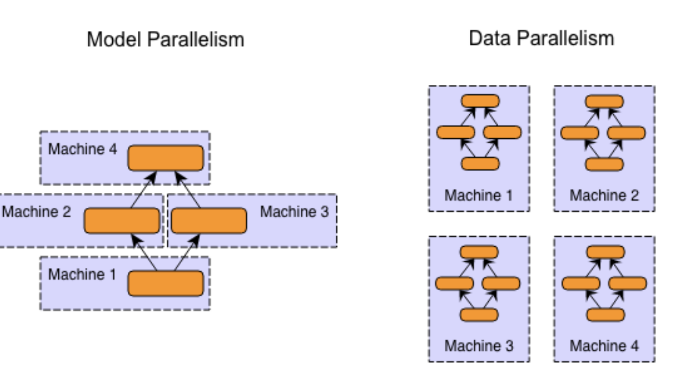
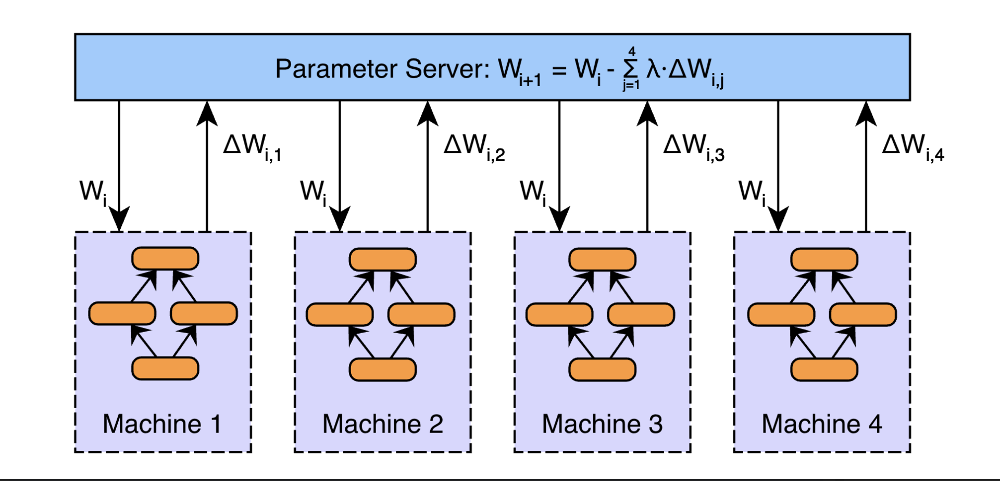
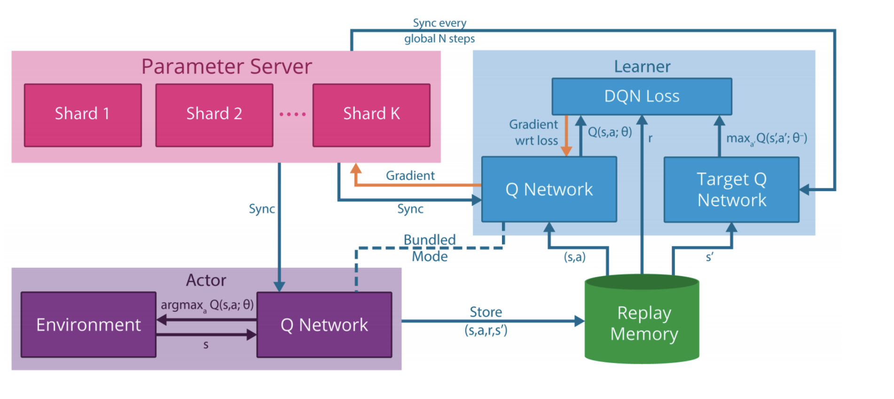
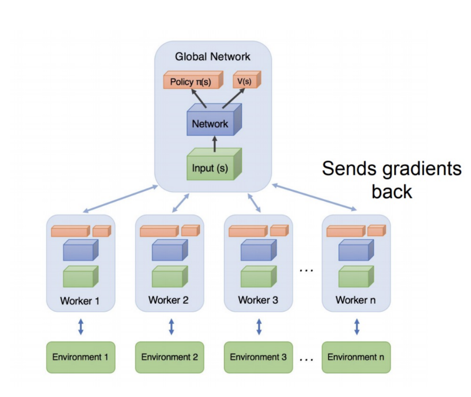
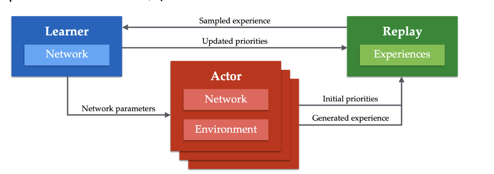
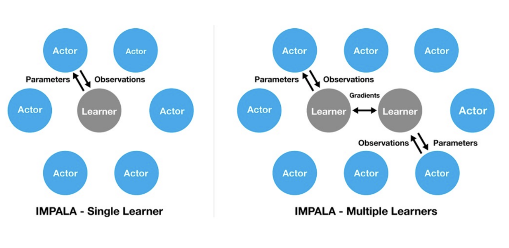
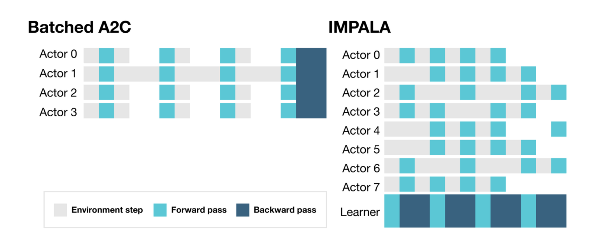

# Distributed Computing and RL System Design
- Large-scale machine learning (reinforcement learning) workloads need to work with **distributed systems** due to the sheer amount of compute required and data involved
  - For distributed systems, consider:
    - **Consistency**: Ensure the consensus of multiple nodes if they are simultaneously working toward one goal
    - **Fault Tolerance**: Handle situations where a node (within a cluster) crashes
    - **Communication**: Handle distributed file systems CPU I/O, and GPU I/O
- Types of Parallelism in Distributed ML Systems:
  - **Model Parallelism**: Different machines are responsible for computation in different parts of a single network
    - Relevant for *very large* neural networks
  - **Data Parallelism**: Different machine has a complete copy of the model, each machine gets a different portion of the data
  - Modern distributed machine leanring systems use a combination of *both*, where there are multiple GPU's and multiple machines handling different data
  - 
- There are various approaches to update model parameters in parallel:
  - **Parameter Averaging**:
    - Distribute a copy of current parameter to each worker
    - Train each worker on a subset of data
    - Set the global parameters to the average of the parameters from each worker
    - Repeat
    - $W_{i + 1} = \frac{1}{N}\sum_{j=1}^N W_{i+1, j}$
    - This can be expensive, especially if the parameters are large (occupies a lot of bandwidth)
  - **Distributed Stochastic Gradient Descent**:
    - Instead of transferring parameters to the parameter server, just transfer updates (gradient) to the parameter server
    - 
  - **Decentralized Asynchronous Stochastic Gradient Descent**:
    - Peer-to-peer communication to transmit compressed model updates
    - The rationale for this is that the centralized parameter server can be very fragile, so eliminating it can allow for more resiliencee
  - **Hogwild: Lock-Free Asynchronous SGD**:
    - With locks:
      - Each thread draws a random example $i$ from training data
      - Acquire a lock on $\theta$
      - Thread reads $\theta$
      - Thread updates $\theta \leftarrow (\theta - \alpha \nabla L(f_\theta (x_i), y_i))$
      - Release lock on $\theta$
    - Asynchronous Stochastic Gradient Descent:
      - Each thread draws a random example $i$ from training data
      - Thread reads current state of $\theta$
      - Thread updates $\theta \leftarrow (\theta - \alpha \nabla L(f_\theta (x_i), y_i))$
      - There can be issues in this asynchronous case if another thread is *reading* the parameters as another thread updates
        - However, it has been shown that the conflict chance is fairly low due to the sparsity of weight updates in large networks
- Update Model in Parallel Systems:
  - **Synchronous Update**: Agents are trained in parallel, but updates are collected and then enforced on network one at a time
    - A downside to this is that we must wait until every agent finishes returning the update in one episode
  - **Asynchronous Update**: The global network is periodically updated by individual workers, and the updates do not happen simultaneously
    - e.g. The parameter server will only do the actual parameter update once it gets enough gradients
    - A downside to this is that the workers may not have matching parameters, which introduces noise - regardless, this is still much quicker to update that synchronous update
## Parallelizing Reinforcement Learning
- One issue is that stepping through a single environment is a *sequential process*
  - In a distributed setting, there are *multiple copies of an agent* each interacting with their *own environment*
- Typical distributed reinforcement learning implementations have *multiple actors* playing in *different environments* to generate training data, and then they send this experience to a *centralized learner* that actually performs the update
  - This is most effective with *off-policy* learning methods
- **General Reinforcement Learning Architecture (GORILA)**: Extends DQN to be able to work in parallel
  - 
  - The actors keep on generating the experience, and so it could be run on a low cost CPU server since it all it is doing is going through the environment
- **Asynchronous Advantage Actor Critic (A3C)**:
  - Involves multi-threaded **asynchronous** variants of one-step SARSA, one-step Q learning, n-step Q learning, and advantage actor-critic
  - This eliminates the reply buffer and instead relies on *parallel actors* to explore different parts of the environment
    - Diversity of the agents (in exploring different parts of the environment) makes no need for replay memory to stabilize the training
  - Unlike GORILA, this approach is meant to be trained on CPU
  - 
- **A2C**:
  - Synchronous implementation, where we wait for each actor to finish its experience and then average the update over all the actors
  - This effectively utilizes GPUs (large batch size), which is more cost-effective than A3C when using a single GPU machine
- **Apex-X (Distributed Prioritized Experience Replay)**:
  - A3C and A2C do not scale quite well across multiple machines
  - 
- **IMPALA (Importance Weighted Actor-Learner Architecture)**: 
  - Actors are only used to generate experience (no gradient)
  - There are completely independent actors and learners
  - 
  - 
- **RLlib**: Building abstraction for distributed RL
  - Decompose common components and reuse (e.g. Parameter Server Component, Actor Component, Replay Component, etc.)
## Misc
- Hogwild Implementation:
  -     d