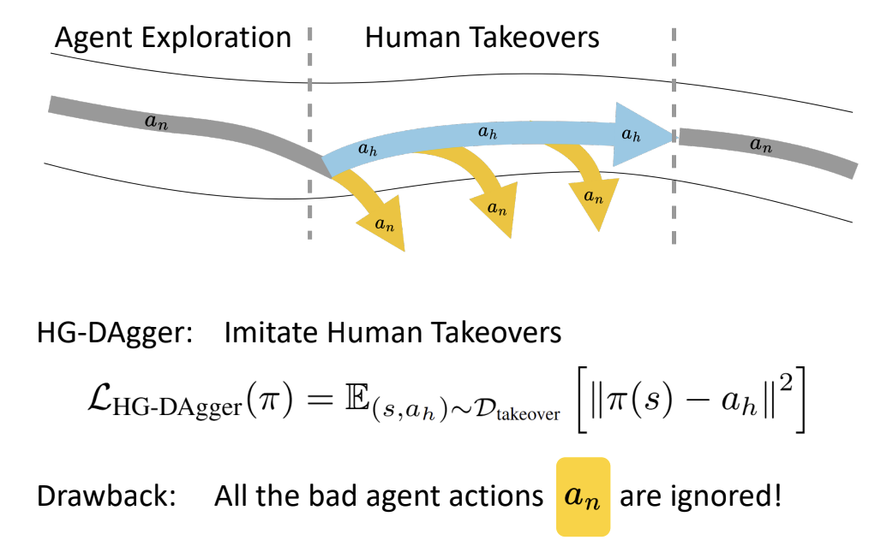
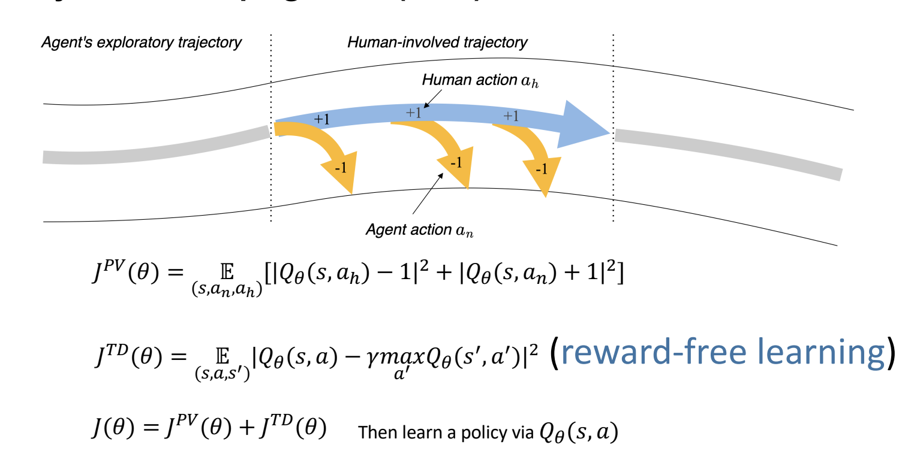
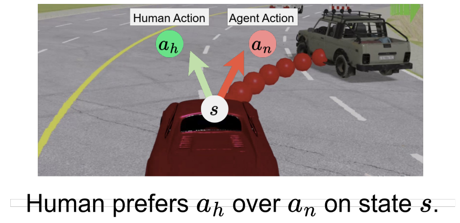
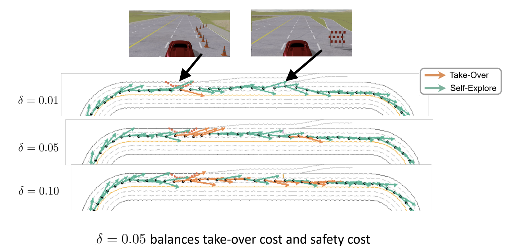

# Imitation Learning
## Introduction on Imitation Learning
- Imitation learning involves the *supervised learning* of a policy network, where a ground-truth action is provided for each state (usually by an expert)
  - This is known as **behavioral cloning**
- There are some limitations with this approach
  - The trained policy might learn into *off-course situations*, where it might not necessarily know what to do
  - Mistakes also grow quadratically in $T$ (time), which might again result in off-course paths 
    - Minor mistakes essentially add up and result in divergence from learned course
    - $\bold{J(\hat{\pi}_{sup})} \leq \bold{T^2} \epsilon$
  - If it is feasible to do so, these limitations could be mitigated by simuating off-course situation data and then learning to recover from there
## DAgger
- To deal with off-course situations, one could collect training samples for off-expert situations, run the policy and observe the actions, and then ask experts to label the possible actions again (of the off-course samples)
- **DAgger (Dataset Aggregation)**: Try to match the data distribution to the agent exploration distribution. Essentially, collect data from the policy and then have the human to label the collected data
  - Train $\pi_\theta(a_t | o_t)$ from human data $\mathcal{D} = \{o_1, a_1, ..., o_n, a_n\}$
  - Run $\pi_\theta(a_t | o_t)$ to get dataset $\mathcal{D}_\pi = \{o_1, ..., o_m\}$
  - Ask human to label $\mathcal{D}_\pi$ with actions $a_t$
  - Aggregate $\mathcal{D} \leftarrow D \cup D_\pi$
- One issue with this approach is that it can be expensive to get expert annotations
  - An alternative, then, can be to use *another, slow algorithm* (such as a brute-force search) as the labeler rather than a human
## Interactive Imitation Learning
- **HG-DAgger**: Interactive imitation learning where *expert interventions* correct a novice's action to overcome distributional shift and error compounding
  - Train $\pi^t _\theta (u_t | o_t)$ from human data $\mathcal{D}_{\pi^*}^0  = \{o_1, u_1, ..., o_N, u_N\}$
  - Run $\pi^t _\theta (u_t | o_t)$. If human decides to take take control, then record state and control into $\mathcal{D}^t_\pi = \{o_1^t, u_1^t, ...\}$
  - $D^{t+1}_{\pi^*} \leftarrow D^{t}_{\pi^*} \cup D^t_\pi$
- One drawback of HG-DAgger is that *bad agent actions* are ignored
  - 
  - One improvement to this is to *promote* the human action while *penalizing* the agent's (bad) action (learn $Q$ function)
    - 
- **Predictive Preference Learning**: *Visualize* the predicted agent's future trajectory, and the human can then make a decision on whether or not to intervene based on this predicted trajectory
  - 
  - Can leverage preference learning on predicted agent trajectories: $\mathcal{L}(\pi)= \mathbb{E}_{(s, a^+, a^-)}[\log \sigma (\beta \log \frac{\pi(a^+ | s)}{\pi(a^- | s)})]$
    - Essentially train the model to maximize taking actions that are preferred (expert takes over)
    - This approach has a good amount of sample efficiency 
- **Human-Gated Intervention** involves a human monitoring the agent - they are always involved
  - This is expensive
- **Robot-Gated Intervention** involves an *uncertainty estimation* built into the agent, in which the agent *requests human help when uncertain*
  - **Adaptive Intervention Mechanism (AIM)**: Use a proxy $Q$ function to estimate uncertainty
  - $J^{AIM}(\theta) = \mathbb{E}_{(s, a_n, a_h)} = \{|Q_\theta (s, a_n) + 1|^2 + |Q_\theta (s, a_h) - 1|^2, ||a_h - a_n|| \geq \epsilon ; |Q_\theta (s, a_h) -1|^2, ||a_h - a_n|| \leq \epsilon \}$
  - Requests help when $Q_\theta(s, a_n)$ is less than the $\delta$-th quantile of $Q_\theta(s, a_n)$
  - 
## Inverse RL and GAIL
- **Inverse Reinforcement Learning**: Learn a cost/reward function that could explain expert behaviors
  - Sometimes, it is easier to *provide expert data* rather than define rewards
- One approach: **Maximum Entropy IRL**:
  - Observe expert trajectories $\mathcal{D} = \{\tau_i \}, \tau = (s_0, a_0, ..., s_T)$
  - Assume reward is linear: $R(\tau) = \sum_t w^T \phi(s_t, a_t)$
    - Goal: Recover $w$
  - The objective function finds a distribution over trajectories that matches expert behavior but is otherwise maximally uncertain
    - $\max_{p(\tau)} H(p) = - \sum_\tau p(\tau) \log p(\tau)$ subject to $\mathbb{E}_p [\phi(\tau)] = \hat{\phi}_{expert}$
  - Solving yields:
    - $p(\tau | w) = \frac{1}{Z(w)} \exp(R(\tau))$, where $Z(w) = \sum_\tau \exp(R(\tau))$
    - Expert trajectories are exponentially more likely if rewards are high
  - $\mathcal{L} (w) = \sum_{\tau \in \mathcal{D}} [R(\tau) - \log Z(w)]$
    - $\nabla_w \mathcal{L} = \mathbb{E}_{expert}[\phi] - \mathbb{E}_{model}[\phi]$
- **Generative Adversarial Imitation Learning (GAIL)**: IRL without explicit reward recovery. This matches expert occupancy measures via a GAN-like discriminator 
  - The objective is modeled as a discriminator $D(s, a)$ trained to predict whether a given state $s$ and action $a$ is sampled from the demonstrations $M$ or generated by running the policy $\pi$
    - $\argmin_D -\mathbb{E}_{d^{\mathcal{M}}(s, a)}[\log D(s, a)] - \mathbb{E}_{d^\pi (s,a)} [\log (1 - D(s, a))]$
    - The policy is then tuned using RL objectives with rewards specified by $r_t = -\log (1 - D(s_t, a_t))$
  - One limitation is that this only works for trajectories with (state, action) pairs, but in practice (real-world) there are a lot of state-only demonstrations in the real world
    e.g. Motion capture (poses) does not necessarily contain actions (muscle activations)
- **Adversarial Motion Prior**: Extend GAIL to settings with state-only demonstrations by having the discriminator be trained on state transitions instead of state-action pairs
  - $\argmin_d -\mathbb{E}_{d^{\mathcal{M}}(s, s')}[\log D(s, s')] - \mathbb{E}_{d^\pi (s,s')} [\log (1 - D(s, s'))]$
  - The policy reward function is then just $r(s_t, s_{t+1}) = \max[0, 1 - 0.25(D(s_t, s_{t+1}) - 1)^2]$
  - The imitation reward can be combined with a task-specific reward: $r(s_t, a_t, s_{t+1}, g) = w^G r^G (s_t, a_t, s_t, g) + w^S r^S (s_t, s_{t+1})$
## Improving on the Model of Imitation Learning
## Unifying Imitation Learning and Reinforcement Learning