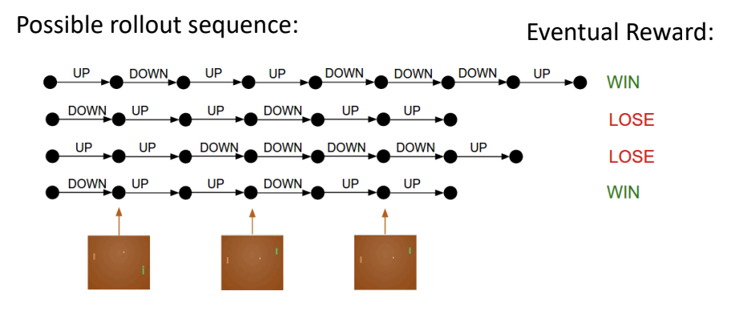

# Introduction
- In **supervised learning**, we have annotated data which we assume is i.i.d (independent and identicially distributed)
  - In **reinforcement learning**, however, the data is not necessarily i.i.d. but instead is rather a correlated time series; in addition, there is not instant feedback regardign a label for the correct action
- With reinforcement learning:
  - The learner must try to *discover* which actions yield the most reward by trying them (trial-and-error exploration)
  - The learner must rely on a *reward signal*, which is often delayed
  - The actions of the agent actually affect the subsequent data it receives (since it can change the environment)
- Example: Pong
  - Actions: Move either UP or DOWN
    - The raw pixels of the image (of the game) are fed into a policy network, which output an action
  - If we are performing imitation learning, then there is a correction label provided, which can be used for backpropagation on the policy network
  - With actual reinforcement learning, though, there are sample actions (rollout) that are performed (in an episode) until the game is over
    - The reward based on the rollout sequence (e.g. a win or loss) is used to penalize the performed actions and perform learning
  - 
  