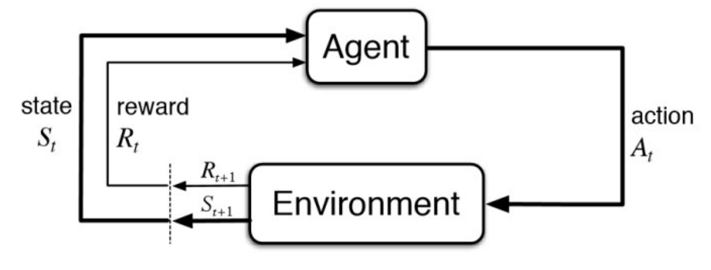
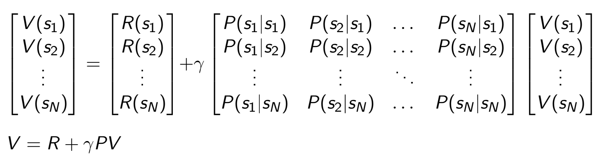
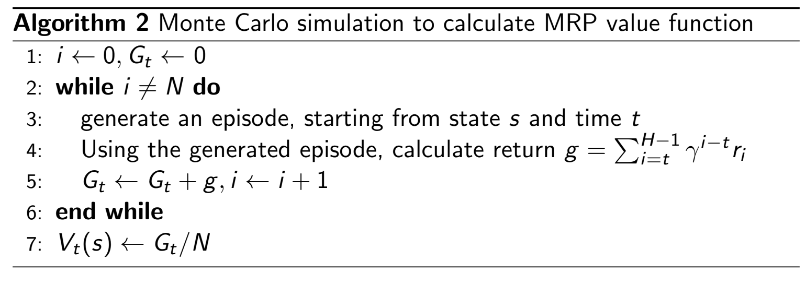
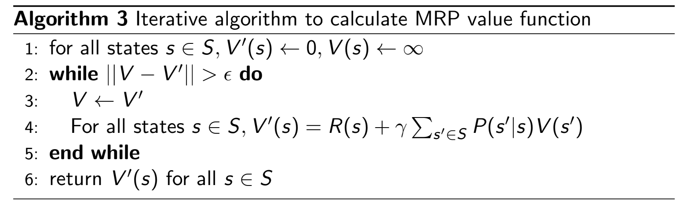
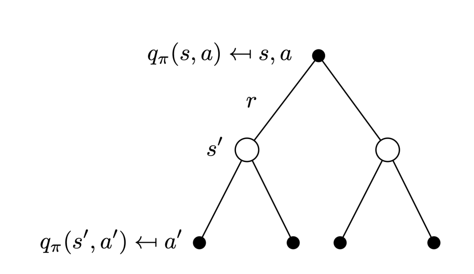
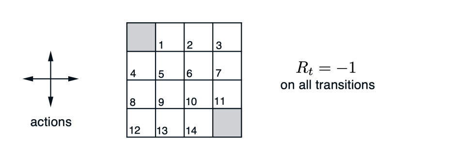
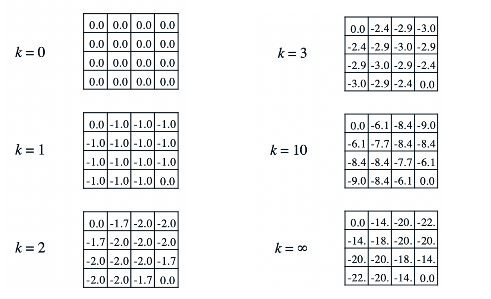

# Markov Decision Processes
## RL Basics
- 
  - Reward: Scalar feedback signal, indicating how well an agent is doing at step $t$
    - The objective of an agent in reinforcement learning is to *maximize* the cumulative reward: $G_t = \sum_{k = 0}^{\infty} R_{t + k + 1}$. Specifically, to maximize the expectation of this reward: $\mathbb{E}_\pi [G_t]$
    - The agent selects its actions based on this reward-maximizing objective. Since rewards may be delayed, actions may inherently have *long-term consequences* - must balance immediate and long-term rewards
- Components of an RL Agent:
  - **Policy $\pi(s)$**: Agent's behavior function
    - Maps states to actions
    - Stochastic Policy: $\pi(a|s) = P[A_t=a|S_t=s]$
    - Deterministic Policy: $a^* = \arg \max_a Q(s_t, a)$
      - View $Q$ as being an implicit policy function
  - **Value Function $V(s)$**: How good is each state or action
    - Formally, this is the expected discount sum of future rewards under a particulary policy $\pi$ - intuitively, this corresponds to how "good" a state is under a particular policy
    - $v_\pi(s) = \mathbb{E}_\pi [G_t | S_t = s] = \mathbb{E}_\pi [\sum_k \gamma^k R_{t+k+1} | S_t = s]$
      - $\gamma$ is the discounting factor, allowing for later rewards to decay (so the expectation converges)
  - **Action-Value Function $Q(s,a)$**: How good is an action in a certain state
    - $Q(s, a) = \mathbb{E}_\pi [G_t | S_t = s, A_t = a] = \mathbb{E}_\pi [\sum_k \gamma^k R_{t + k + 1} | S_t = s, A_t = a]$
  - **Model**: Agent's representation of the environment
    - Next state prediction: $P[S_{t + 1} = s' | S_t = a, A_t = a]$
    - Next reward prediction: $E[R_{t + 1} | S_t = s, A_t = a]$
- The Q-function can be estimated:
  - $Q_t(a) = \frac{\text{sum of rewards when a taken prior to t}}{\text{number of items a taken prior to t}} = \frac{\sum_{i=1}^{t-1}r_i \cdot 1_{A_i = a}}{\sum_{i = 1}^{t - 1} 1_{A_i = a}}$
- With this estimation of $Q$, a greedy action selection algorithm involves just choosing $A_t = \argmax_a Q_t(a)$
  - There is no exploration in doing this, so an $\epsilon$-Greedy algorithm has a small probability to select random actions
    - $1-\epsilon$ probability to select $A_t = \argmax_a Q_t(a)$ and otherwise a $\epsilon$ probability to select $A_t = \text{uniform}(A)$
## Markov Decision Process
- **Markov Decision Processes** can model many real-world problems where the environment is *fully observable*
- Given a history of state $h_t = \{s_1, s_2, s_3, ..., s_t\}$, the state $s_t$ is Markovian if and only if:
  - $p(s_{t+1}|s_t) = p(s_{t+1}|h_t)$
  - $p(s_{t+1}|s_t, a_t) = p(s_{t+1}|h_t, a_t)$
- **Markov Reward Processes** involve rewards as well. Formally:
  - $S$ is a finite set of states
  - $P$ is a dynamics/transition model $P(S_{t+1} = s' | s_t = s)$
  - $R(s_t = s) = \mathbb{E}[r_t | s_t = s]$
    - Can represent this is a vector if there are a finite number of states (each entry corresponds to the reward at that state)
  - $\gamma \in [0, 1]$
- In an environment, the **horizon** is the number of maximum time steps (which can be infinity) in each trajectory
  - The **return** is the discounted sum of rewards from time step $t$ to the horizon: $G_t = R_{t + 1} + \gamma R_{t + 2} + \gamma^2 R_{t+3} + ... + \gamma^{T - t - 1}R_T$
  - With this, the state value function is just the expectation of the return from $t$ in state $s$: $V_t(s) = \mathbb{E}[R_{t + 1} + \gamma R_{t + 2} + \gamma^2 R_{t+3} + ... + \gamma^{T - t - 1}R_T | s_t = s]$
- Example:
  - 
  - Consider the reward being +5 in $s_1$, +10 in $s_7$, and 0 everywhere else. This means $R = [5, 0, 0, 0, 0, 0, 10]$
  - If $\gamma = \frac{1}{2}$, then the returns for the following episoddes are:
    - $s_4, s_5, s_6, s_7: 0 + 0.5 * 0 + 0.25 * 10 = 2.5$
    - $s_4, s_3, s_2, s_1: 0 + 0.5 * 0 + 0.25 * 5 = 1.25$
    - $s_4, s_5, s_6, s_6: 0$
  - The value function can be estimated for $s_4$ by averaging: $V(s_4) \approx \frac{1}{3}(2.5 + 1.25 + 0)$
- The value function in a Markov Reward Process satisfies the **Bellman equation**:
  - $V(s) = R(s) + \gamma \sum_{s' \in S} P(s' |s) V(s')$
    - Immediate reward plus discount sum of future reward
  - This can be expressed in a matrix form:
    - 
  - Solving this analytically is too expensive, especially as the number of states scales ($O(N^3)$), so other methods are necessary
  - Monte Carlo Algorithm for Computing the Value of a MRP: 
    - 
    - This requires generating a lot of trajectories (not using environment dynamics) so that the expectation converges to a stable value
  - Iterative Algorithm for Computing the Value of a MRP:
    - 
- **Markov Decision Processes** are Markov Reward Processes but with decisions, so there is now $A$ finite set of actions and $P(s_{t+1} = s' | s_t = s, a_t = a)$ and $R(s_t = s, a_t = a)$
  - There is now a *policy* to specify what action to take in each state: $\pi(a|s) = P(a_t = a | s_t = s)$
    - Policies are time-independent, so $A_t \sim \pi(a|s)$ for any $t > 0$
  - Marginalizations:
    - $P^\pi(s' | s) = \sum_{a \in A} \pi (a|s) P(s' | s, a)$
    - $R^\pi(s) = \sum_{a \in A} \pi(a|s)R(s,a)$
  - Since there is now a policy, the state-value function is the expected return of starting from state $s$ and following policy $\pi$:
    - $v^\pi(s) = \mathbb{E}_\pi[G_t | s_t = s]$
  - The action-value function is the expected return from starting from state $s$, taking action $a$, and then following policy $\pi$:
    - $q^\pi(s, a) = \mathbb{E}_\pi[G_t | s_t = s, A_t = a]$
  - Both $v$ and $q$ are related:
    - $v^\pi(s) = \sum_{a \in A} \pi(a|s)q^\pi (s,a)$
  - Both $v$ and $q$ can be expressed recursively:
    - $v^\pi(s) = \mathbb{E}_\pi[R_{t + 1} + \gamma v^\pi (s_{t+ 1}) | s_t = s]$
    - $q^\pi(s,a) = \mathbb{E}_\pi[R_{t+1} + \gamma q^\pi(s_{t+1}, A_{t+1}) | s_t = s, A_t = a]$
  - Combining the two aforementioned facts:
    - $v^\pi(s) = \sum_{a \in A} \pi(a | s)(R(s, a) + \gamma \sum_{s' \in S} P(s'|s, a) v^\pi(s'))$
    - $q^\pi(s,a) = R(s,a) + \gamma \sum_{s' \in S} P(s' | s, a) \sum_{a' \in A} \pi(a' |s') q^\pi(s', a')$
  - It can be useful to understand $v$ and $q$ in terms of **backup diagrams** - think intuitively of taking the expectation over the tree
    - 
    - 
### Value Prediction
- To evaluate a policy $\pi$, we can compute $v^\pi(s)$ - this is the same as value prediction
- Value prediction can be solved via **dynamic programming**, leveraging the aforementioned Bellman Equation:
  - Algorithm:
    - At each iteration $t + 1$, update $v_{t + 1}(s)$ from $v_t(s')$ for all states $s \in S$ where $s'$ is the successor state of $s$:
      - $v_{t + 1}(s) = \sum_{a \in A} \pi(a|s)(R(s, a) + \gamma \sum_{s' \in S} P(s'|s,a) v_t(s'))$
    - Repeat this until the value function stabilizes (difference between old and new is small)
- Example: Gridworld:
  - 
  - Consider a uniform random policy (so each direction has a chance of 0.25) and $\gamma = 1$
    - 
      - Sanity check for $k=3$ first state: $(0.25)(-1 + 0) + (0.25)(-1 - 1.7) + (0.25)(-1 - 2) + (0.25)(-1 - 2) = -2.425$
### Control
- The goal is to find an **optimal policy**: $\pi^*(s) = \argmax_\pi v^\pi(s)$
  - This policy is deterministic and stationary but may not necessarily be unique
- This optimal policy is related to the *optimal value* - in fact, knowing the optimal value enables the derivation of the optimal polic(ies)
  - $v^*(s) = \max_\pi v^\pi(s)$
  - $\pi^*(s) = \argmax_\pi v^\pi(s)$
- Similarly, knowing the optimal $q$ can easily derive an optimal policy:
  - $\pi^*(a|s) = \{ 1 \ \text{if} \ a=\argmax_{a \in A} q^*(s, a), 0 \ \text{otherwise} \}$
- **Policy Iteration**:
  - Evaluate the policy $\pi$ and improve the policy by acting greedily with respect to $v^\pi$, repeating until convergence
  - Evaluation uses the aforementioned dynamic programming method (Bellman Backup)
  - Policy improvement:
    - Compute $q^{\pi_i}(s,a) = R(s,a) + \gamma \sum_{s' \in S} P(s' | s, a) v^{\pi_i}(s')$
    - Compute $\pi_{i + 1}(s) = \argmax_{a} q^{\pi_i}(s, a)$
  - This results in a *monotonic improvement in policy*:
    - By doing $\pi'(s) = \argmax_a q^\pi(s, a)$, it the value at any state is improved:
      - $q^\pi(s, \pi'(s)) = \max_{a \in A}q^\pi(s, a) \geq q^\pi(s, \pi(s)) = v^\pi(s)$
      - Since the policy is deterministic, the value at a state is the same as the q-value at that state - no need to consider other actions
    - This therefore improves the value function:
      - $v^\pi(s) \leq q^\pi(s, \pi'(s)) = \mathbb{E}_{\pi'}[R_{t+1} + \gamma v^\pi(S_{t+ 1})| S_t = s]$
      - $v^\pi(s) \leq \mathbb{E}_{\pi'}[R_{t+1} + \gamma q^\pi(S_{t+ 1}, \pi'(S_{t+1})) | S_t = s]$
      - $v^\pi(s) \leq \mathbb{E}_{\pi'}[R_{t+1} + \gamma R_{t+2} + \gamma^2 q^\pi(S_{t+ 2}, \pi'(S_{t+2})) | S_t = s]$
      - $v^\pi(s) \leq \mathbb{E}_{\pi'}[R_{t+1} + \gamma R_{t+2} + ...| S_t = s] = v^{\pi'}(s)$
    - Once improvements stop, the optimal value has been reached
- **Value Iteration**:
  - The optimal value and action-value functions are related:
    - $v^*(s) = \max_a q^*(s,a)$
      - Optimal policy is deterministic - no need to average actions because there is only one
    - $q^*(s, a) = R(s, a) + \gamma \sum_{s' \in S} P(s' | s, a) v^*(s')$
  - Using the aforementioned facts:
    - $v^*(s) = \max_a R(s, a)+ \gamma \sum_{s' \in S} P(s' | s, a) v^*(s')$
    - $q^*(s, a) = R(s, a) + \gamma \sum_{s' \in S} P(s' | s, a) \max_{a'} q^*(s', a')$
  - With value iteration, the goal is to just find the optimal value function iteratively first, and then derive the optimal policy from it *afterwards*:
    - $v(s) \leftarrow \max_{a \in A}(R(s, a) + \gamma \sum_{s' \in S} P(s' | s, a) v(s'))$
  - Algorithm:
    - For $k = 1$:
      - For each state $s$:
        - $q_{k + 1}(s, a) = R(s, a) + \gamma \sum_{s' \in S}P(s' | s, a) v_k(s')$
        - $v_{k + 1}(s) = \max_a q_{k + 1}(s, a)$
      - $k \leftarrow k + 1$
    - Retrieve optimal policy:
      - $\pi(s) = \argmax_a R(s, a) + \gamma \sum_{s' \in S} P(s' | s, a)v_{k + 1}(s')$
## Misc
- Dynamic programming methods require sweeping over the entire state set, which can be expensive for environments with large state sets
  - This can be mitigated by leveraging in-place iterative dynamic programming algorithms that are not organized in terms of systematic sweeps of the state set
  - **In-Place Value Iteration**: Only store one copy of the value function rather than two (old one and current one)
    - $v(s) \leftarrow \max_{a \in A} (R(s,a) + \gamma \sum_{s' \in S} P(s' | s, a) v(s'))$
  - **Prioritized Sweeping**: Use magnitude of Bellman error to guide state selection
    - $|\max_{a \in A} (R(s, a) + \gamma \sum_{s' \in S} P(s' | s, a) v(s')) - v(s)|$
      - Backup state with largest remaining Bellman error
      - Update Bellman error of affected states after each backup, and repeat
        - Can use a priority queue to efficiently do this
  - **Real-Time Dynamic Programming**: Use agent experience to determine which states to update - apply updates to states as the agent visits them so that the most relevant states are focused on being updated
  - **Sample Backups**: Use sample rewards and sample transition pairs instead of transition dynamics
    - Works in environments where there is no model information
  - **Approximate Dynamic Programming**: Use a function approximator (neural network) to learn the value function
- Policy Iteration Implementation:
  -     def policy_iteration(env, gamma=1.0):
          """ Policy-Iteration algorithm """
          policy = np.random.choice(env.action_space.n, size=(env.observation_space.n))  # initialize a random policy
          max_iterations = 200000
          gamma = 1.0
          for i in range(max_iterations):
              old_policy_v = compute_policy_v(env, policy, gamma)
              new_policy = extract_policy(old_policy_v, gamma)
              if (np.all(policy == new_policy)):
                  print('Policy-Iteration converged at step %d.' % (i + 1))
                  break
              policy = new_policy
          return policy

        def compute_policy_v(env, policy, gamma=1.0):
          """ Iteratively evaluate the value-function under policy.
          Alternatively, we could formulate a set of linear equations in iterms of v[s] 
          and solve them to find the value function.
          """
          v = np.zeros(env.observation_space.n)
          eps = 1e-10
          while True:
              prev_v = np.copy(v)
              for s in range(env.observation_space.n):
                  policy_a = policy[s]
                  v[s] = sum([p * (r + gamma * prev_v[s_]) for p, s_, r, _ in env.P[s][policy_a]])
              if (np.sum((np.fabs(prev_v - v))) <= eps):
                  # value converged
                  break
          return v

        def extract_policy(v, gamma=1.0):
          """ Extract the policy given a value-function """
          policy = np.zeros(env.observation_space.n)
          for s in range(env.observation_space.n):
              q_sa = np.zeros(env.action_space.n)
              for a in range(env.action_space.n):
                  q_sa[a] = sum([p * (r + gamma * v[s_]) for p, s_, r, _ in env.P[s][a]])
              policy[s] = np.argmax(q_sa)
          return policy
- Value Iteration Implementation:
  -     def value_iteration(env, gamma=1.0):
          """ Value-iteration algorithm """
          v = np.zeros(env.observation_space.n)  # initialize value-function
          max_iterations = 100000
          eps = 1e-20
          for i in range(max_iterations):
              prev_v = np.copy(v)
              for s in range(env.observation_space.n):
                  q_sa = [sum([p * (r + gamma * prev_v[s_]) for p, s_, r, _ in env.P[s][a]]) for a in
                          range(env.action_space.n)]
                  v[s] = max(q_sa)
              if (np.sum(np.fabs(prev_v - v)) <= eps):
                  print('Value-iteration converged at iteration# %d.' % (i + 1))
                  break
          return v

        def extract_policy(v, gamma=1.0):
          """ Extract the policy given a value-function """
          policy = np.zeros(env.observation_space.n)
          for s in range(env.observation_space.n):
              q_sa = np.zeros(env.action_space.n)
              for a in range(env.action_space.n):
                  for next_sr in env.P[s][a]:
                      # next_sr is a tuple of (probability, next state, reward, done)
                      p, s_, r, _ = next_sr
                      q_sa[a] += (p * (r + gamma * v[s_]))
              policy[s] = np.argmax(q_sa)
          return policy