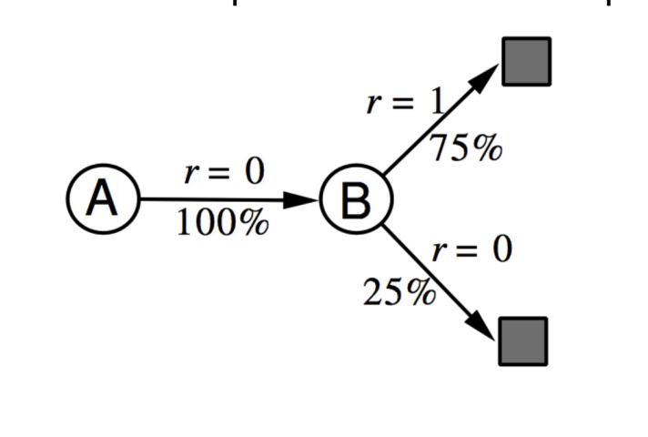
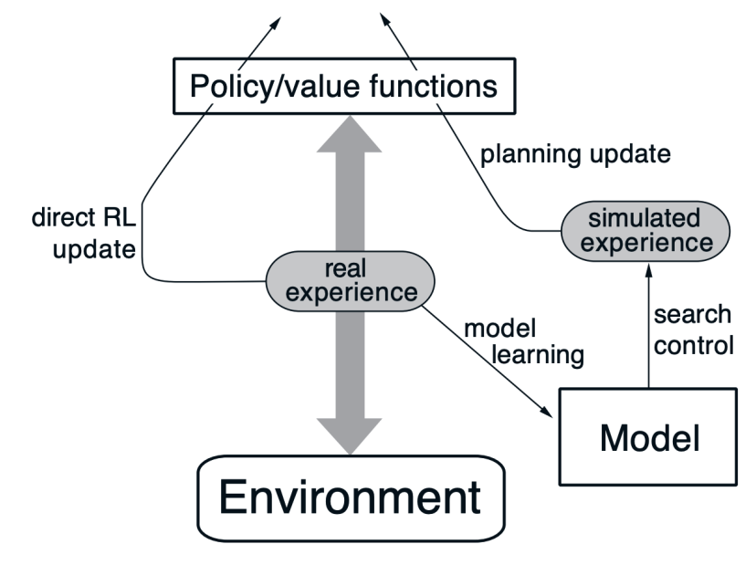
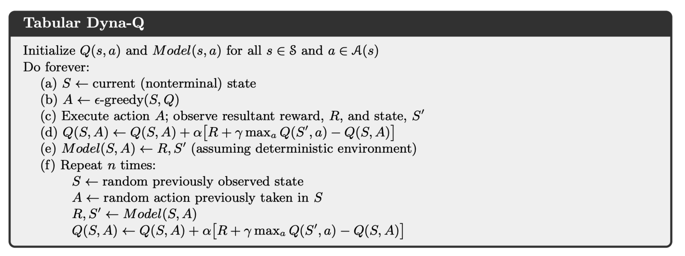
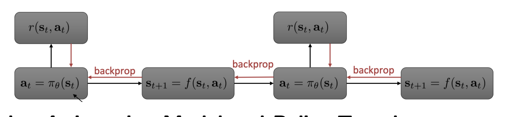
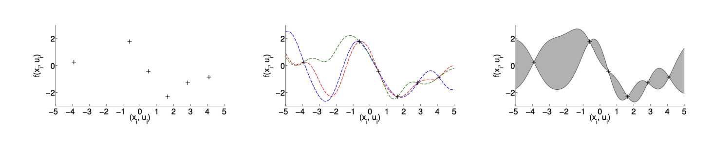

# Model-Based Reinforcement Learning
- Previous reinforcement learning algorithms were *model-free*, as the policy was learned directly through experiences, and the value function was learned either through Monte Carlo or Temporal Difference methods
- With *model-based* reinforcement learning, the agent learns a model of the environment from experience, allowing it to predict $s_{t+1}, r_{t+1}$ based on a given $s_t, a_t$
  - This allows for value/policy functions to be planned from the model
- Planning is the computational process that takes a *model* as input and produces or improves a policy by interacting with the modeled environment
  - **State-Space Planning**: Search through the state space for an optimal policy or an optimal path to a goal
  - **Model-Based Value Optimization**: Use a model to simulate trajectories and, from those backups, determine the values to pick a policy
  - **Model-Based Policy Optimization**: Derive a policy directly from the model
- A major advantage of model-based reinforcement learning is that it is very sample-efficient, which is critical for real-world application such as robotics 
  - The downside to this, though, is that learning a model and then constructing a value function or policy function based on this learned model can lead to two sources of approximation error
- Formally, a model $\mathcal{M}$ is a representation of a Markov Decision Process parameterized by $\eta$, and it usually represents state transitions and rewards $\mathcal{M} = (\mathcal{P}, \mathcal{R})$
  - $S_{t+1} \sim \mathcal{P}(S_{t+1} | S_t, A_t)$
  - $R_{t+1} \sim \mathcal{R}(R_{t+1} | S_t, A_t)$
  - Example Models:
    - Go: The rules of the game is already the model, and so there is no need to learn a model
    - Driving Environments: The model is more complex here, and so some sort of physics model must be learned (dynamics and kinematics)
## Model-Based Value Optimization
- To actually learn the model, we can treat it as a *supervised learning problem*
  - There are already labels from the collected transitions ($S_1, A_1 \rightarrow R_2, S_2$)
  - Learning $s, a \rightarrow r$ is a regression problem
  - Learning $s, a \rightarrow s'$ is a density estimation problem
  - A loss function like MSE or KL-Divergence can be used to optimize model parameters that minimizze the empirical loss
- There are various ways to *parameterize the model*
  - **Table Lookup Model**: Model is an explicit Markov Decision Process, $\hat{\mathcal{P}}, \hat{\mathcal{R}}$
    - Count visits $N(s,a)$ to each state-actiojn pair
    - $\hat{\mathcal{P}}^a_{s, s'} = \frac{1}{N(s,a)} \sum_{t=1}^T \bold{1} (S_t = s, A_t = a, S_{t+1} = s')$
    - $\hat{\mathcal{R}}^a_{s} = \frac{1}{N(s,a)} \sum_{t=1}^T \bold{1}(S_t = s, A_t = a)R_t$
    - Example: Two states $A$ and $B$, and no discounting
      - Observations: (A, 0, B, 0), (B, 1), (B, 1), (B, 1), (B, 1), (B, 1), (B, 1), (B, 0)
      - $\hat{\mathcal{P}}_{a, b} = 1$
      - $\hat{\mathcal{R}}_{b} = \frac{6}{8}$
      - 
- **Sample-Based Planning**: Sample-efficient approach to planning
  - Use the model only to generate samples
  - Procedure:
    - Sample experience from the model:
      - $S_{t+1} \sim \mathcal{P}_\eta (S_{t+1} | S_t, A_t)$
      - $R_{t+1} \sim \mathcal{R}_\eta (R_{t+1} | S_t, A_t)$
    - Apply model-free RL to sampled experiences (Monte Carlo, Sarsa, Q-Learning)
  - Example: From previous table lookup example:
    - Sample experiences from the model: $(B, 1), (B, 0), (B, 1), (A, 0, B, 1), (B, 1), (A, 0, B, 1), (B, 1), (B, 0)$
    - Using Monte-Carlo learning: $V(A) = 1$ and $V(B) = 0.75$
- If a model is inaccurate, then the performance of model-based reinforcement learning is limited to the optimal policy for approximate Markov Decision Processes
  - When the model is inaccurate, the planning process will compute a suboptimal policy
  - One solution to this is, when the accuracy of the model is low, resort back to model-free RL
  - Another solution is to reason explicitly about model uncertainty (how confident we are for the estimated state) using probabilistic models such as Bayesian and Gaussian Processes
- With model-based reinforcement learning, there are *two sources of experience*:
  - **Real Experience**: Sampled directly from the environment
    - $S', S \sim \mathcal{P}^a_{s, s'}$
    - $R', R \sim \mathcal{R}^a_{s}$
  - **Simulated Experience**: Sampled from the model 
    - $\hat{S}', \hat{S} \sim \hat{\mathcal{P}}_\eta (S' | S, A)$
    - $\hat{R} \sim \hat{\mathcal{R}}_\eta (R | S, A)$
- **Dyna** for Integrating Learning, Planning, and Reacting
  - 
  - 
    - In some environments, increasing the number of planning steps $n$ can improve performance
## Model-Based Policy Optimization
- Recall that, for policy gradient, there is no need for transition dynamics
- However, if the model is known, then it can be used to better learn a policy
  - Control Theory Analog: $\argmin_{a_1, ..., a_T} \sum_{t=1}^T c(s_t, a_t)$ subject to $s_t = f(s_{t-1}, a_{t-1})$
    - Can use the negative reward as the cost function
    - We are not directly optimizing $a_t$ but rather $a_t \sim \pi_\theta (s_t)$
    - There exists many solvers for these types of control problems (e.g. Linear-Quadratic Regulator)
- Algorithm #1:
  - Run base policy $\pi_0 (a_t | s_t)$ (random policy) to collect $\mathcal{D} = \{ (s, a, s')_i\}$
  - Learn dynamics model $s' = f(s, a)$ to minimize $\sum_i ||f(s_i, a_i) -s'_i||^2$
  - Plan through $f(s, a)$ to choose actions
    - Do this by using LQR to calculate the optimal trajectory using the model and a cost function: $\min_{a_1, ..., a_T} \sum_{t=1}^T c(s_t, a_t)$ subject to $s_t = f(s_{t-1}, a_{t-1})$
- Algorithm #2: Accounts for potential *drifting error* in trajectory
  - Run base policy $\pi_0 (a_t | s_t)$ (random policy) to collect $\mathcal{D} = \{ (s, a, s')_i \}$
  - Loop:
    - Learn dynamics model $s' = f(s, a)$ to minimize $\sum_i ||f(s_i, a_i) -s'_i||^2$
    - Plan through $f(s, a)$ to choose actions
    - Execute those actions add the resulting data $\{ (s, a, s')_i \}$ to $\mathcal{D}$
- Algorithm #3: Might still go off-grid with previous algorithm, so instead optimize the whole trajectory but take only the *first action*, then observing and planning again in case any corrective action is needed
  - Run base policy $\pi_0 (a_t | s_t)$ (random policy) to collect $\mathcal{D} = \{ (s, a, s')_i\}$
  - Loop each step:
    - Loop every n steps:
      - Learn dynamics model $s' = f(s, a)$ to minimize $\sum_i ||f(s_i, a_i) -s'_i||^2$
    - MPC:
      - Plan through $f(s, a)$ to choose actions
      - Execute first action planned and observe resulting state $s'$
      - Append $(s, a, s')$ to dataset $\mathcal{D}$
- Algorithm #4: Learn the *policy* alongside the model 
  - Run base policy $\pi_0 (a_t |s_t)$ (random policy) to collect $\mathcal{D}=\{(s, a, s')_i\}$
  - Loop:
    - Learn dynamics model $f(s, a)$ to minimize $\sum_i ||f(s_i, a_i) -s'_i||^2$
    - Backpropagate through $f(s, a)$ into the policy to optimize $\pi_\theta (a_t | s_t)$
    - Run $\pi_\theta (a_t | s_t)$, appending the visited $(s, a, s')$ to $\mathcal{D}$
  - 
- Parameterizing the Model:
  - **Global Model**: $s_{t+1} = f(s_t, a_t)$ used to represent a *big neural network*
    - Very expressive, and can use a lot of data to fit
    - However, not so effective in low data regimes and cannot adequately express model uncertainty
  - **Local Model**: Model the transition as time-varying linear Gaussian dynamics
    - This approach is very data-efficient and  can express model uncertainty, but can suffer when the dataset is large or the model dynamics are not so smooth
    - $p(\bold{x_{t+1} | \bold{x_t}, \bold{u_t}}) = \mathcal{N} (f(\bold{x}_t, \bold{u}_t))$
      - $f(\bold{x}_t, \bold{u}_t) = \bold{A}_t \bold{x}_t + \bold{B}_t \bold{u}_t$
      - $x_t$ is the current observation, and $u_t$ is the action
    - 
      - More uncertainty in regions where there are no observations