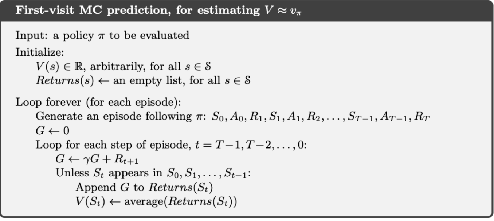
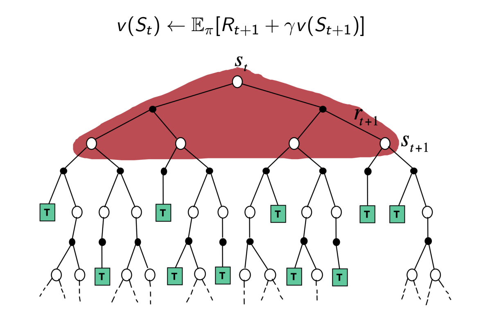
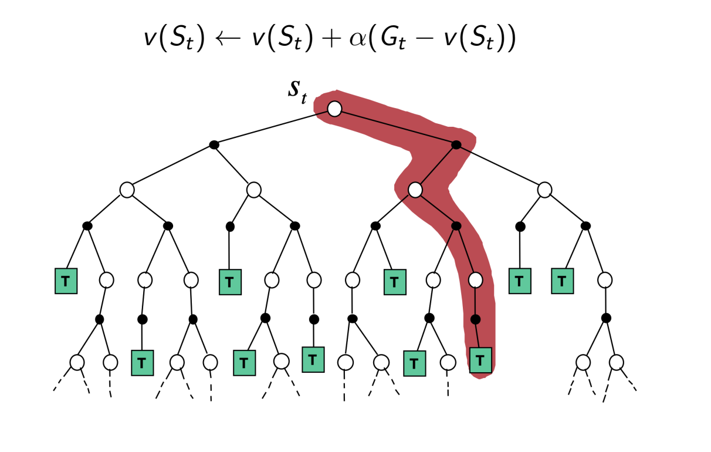
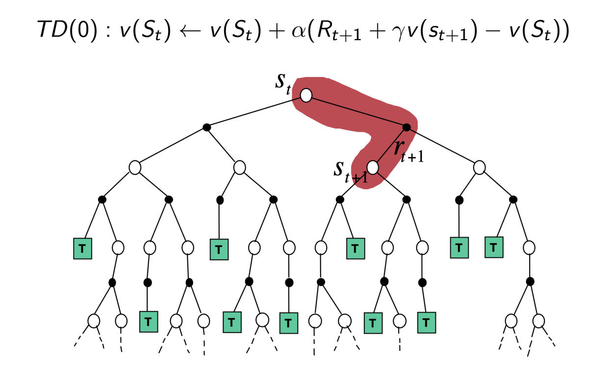
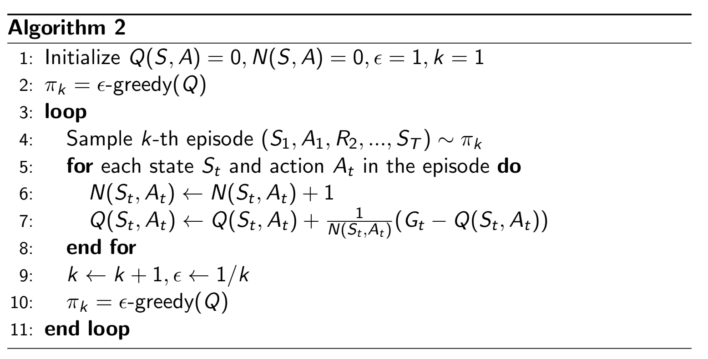
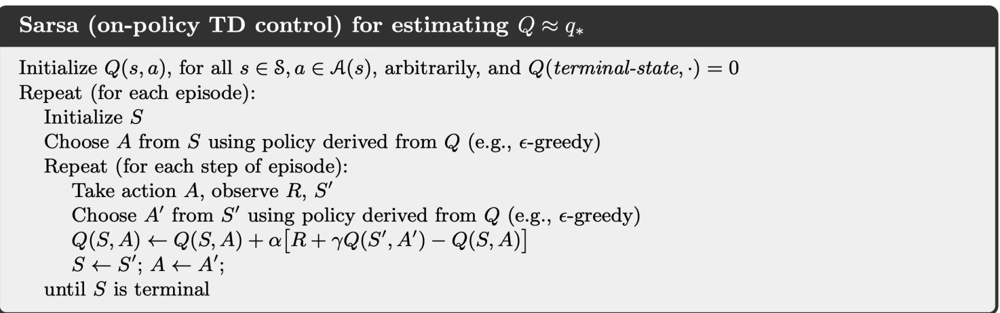
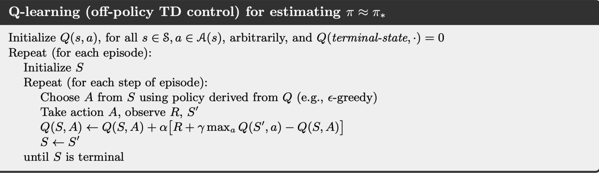
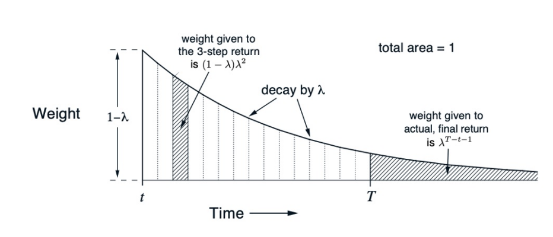

# Model-Free Prediction and Control
- Policy and value iteration assume direct access to the dynamics and rewards of the environment ($P$ and $R$), but in many real-world problems the model is unknown
  - In these cases, the problem must be solved with *direct interaction with the environment* - that is, collecting trajectories $\{ S_1, A_1, R_2, S_2, A_2, R_3, ..., S_T\}$
## Policy Evaluation
- **Monte-Carlo**: Rely on repeatedly sampling *full trajectories* (*complete returns*)
  - 
    - By going backwards, all states (on first visit) can be updated rather than just the starting one
  - Updates can be done incrementally:
    - $\mu_t = \frac{1}{t} \sum_{j = 1}^t x_j = \frac{1}{t}(x_t + \sum_{j = 1}^{t-1} x_j) = \frac{1}{t}(x_t+(t-1)\mu_{t-1}) = \mu_{t-1} + \frac{1}{t}(x_t - \mu_{t - 1})$
    - Collect an episode:
      - $N(s_t) \leftarrow N(s_t) + 1$
      - $v(s_t) \leftarrow v(s_t) + \frac{1}{N(s_t)}(G_t - v(s_t))$
      - $v(s_t) \leftarrow v(s_t) + \alpha(G_t - v(s_t))$
  - Advantages (compared to Dynamic Programming):
    - Works for unknown environments
    - Works better for situations where computing the environment's dynamics is expensive
    - Cost of estimating a single state value is independent of total number of states - can sample episodes starting from a state of interest and average the returns
- **Temporal-Difference (TD) Learning**: Learn from episode trajectories, but sample on *incomplete episodes* by **boostrapping** (updating an estimate using other estimates). This is an *online method*
  - TD(0): Use a single environment step to estimate the value
    - $v(S_t) \leftarrow v(S_t) + \alpha (R_{t+1} + \gamma v(S_{t+1}) - v(S_t))$
      - $R_{t+1} + \gamma v(S_{t+1})$ is the *target*, and $\delta_t= R_{t+1} + \gamma v(S_{t+1}) - v(S_t)$ is the error
  - $n-\text{step}$ TD methods can go beyond other steps - going to an infinite number of steps decomposes back down into the Monte Carlo method
    - $n = 1: G_t^{(1)} = R_{t+1} + \gamma v(S_{t+1})$
    - $n = 2: G_t^{(2)} = R_{t+1} + \gamma R_{t+2} + \gamma^2v(S_{t+2})$
    - $n = \infty: G_t^{(\infty)} = R_{t+1} + \gamma R_{t+2} + \gamma^{T-t-1}R_T$
    - $G_t^n = R_{t + 1} + \gamma R_{t + 2} + ... + \gamma^{n - 1} R_{t + n} + \gamma^n v(S_{t+n})$
    - Update: $v(S_t) \leftarrow v(S_t) + \alpha(G_t^n - v(S_t))$
- Backup Comparisons:
  - Dynamic Programming:
    - 
  - Monte Carlo:
    - 
  - Temporal Difference:
    - 
## Model-Free Control
- **Generalized Policy Iteration with Monte Carlo**: 
  - Algorithm (Exploring Starts):
    - Initialize:
      - $\pi(s) \in A(s)$ (arbitrarily), for all $s \in S$
      - $Q(s, a) \in \mathbb{R}$ (arbitrarily), for all $s \in S, a \in A(s)$
      - $Returns(s, a) \leftarrow$ empty list, for all $s \in S, a \in A(s)$
    - Loop forever (for each episode):
      - Choose $S_0 \in S, A_0 \in A(S_0)$ randomly such that all pairs have probability > 0
        - **This step ensures that all actions are selected infinitely often, for convergence guarnatees**
      - Generate an episode from $S_0, A_0$, following $\pi: S_0, A_0, R_1, ..., S_{T-1}, A_{T-1}, R_T$
      - $G \leftarrow 0$
      - Loop for each step of episode, $t = T - 1, T - 2, ..., 0$:
        - $G \leftarrow \gamma G + R_{t+1}$
        - Unless the pair $S_t, A_t$ appears in $S_0, A_0, S_1, A_1, ..., S_{t-1}, A_{t-1}$:
          - Append G to $Returns(S_t, A_t)$
          - $Q(S_t, A_t) \leftarrow \text{average}(Returns(S_t, A_t))$
          - $\pi(S_t) \leftarrow \argmax_a Q(S_t, a)$
  - Algorithm (Epsilon-Greedy):
    - 
    - With probability $1-\epsilon$ choose the greedy action, and with probability $\epsilon$ choose an action at random
      - $\pi'(a|s) = \{ \epsilon/|A| + 1 - \epsilon \ \text{if} \ a* = \argmax_{a \in A} Q(s, a), \epsilon / |A| \ \text{otherwise} \}$
- **On-Policy Temporal Difference Control (Sarsa)**: 
  - View an episode as an alternating sequence of states and state-action pairs
  - Algorithm:
    - Apply the $\epsilon$-greedy policy for one step, then bootstrap the action value function:
      - $Q(S_t, A_t) \leftarrow Q(S_t, A_t) + \alpha [R_{t + 1} + \gamma Q(S_{t+1}, A_{t+1}) - Q(S_t, A_t)]$
    - Update after every transition from a nonterminal state
  - 
  - This can also be generalized to varying steps, with infinity being reduced to a Monte Carlo approach:
    - $n = 1: q_t^{(1)} = R_{t+1} + \gamma Q(S_{t+1}, A_{t+1})$
    - $n = 2: q_t^{(2)} = R_{t+1} + \gamma R_{t+2} + \gamma^2 Q(S_{t+2}, A_{t+2})$
    - $n = \infty: q_t^{(\infty)} = R_{t+1} + \gamma R_{t+2} + ... + \gamma^{T - t - 1} R_T$
    - $n: q_t^{(\infty)} = R_{t+1} + \gamma R_{t+2} + ... + \gamma^{n -1}R_{t+n} + \gamma^{n} Q(S_{t+n}, A_{t+n})$
    - Update: $Q(S_t, A_t) \leftarrow Q(S_t, A_t) + \alpha(q_t^{(n)} - Q(S_t, A_t))$
- On-Policy versus Off-Policy:
  - **On-Policy Learning**: Learns about a policy $\pi$ from experience collected from $\pi$
    - Typically, this involves behaving non-optimally to explore all actions, then reducing the exploration (like with $\epsilon$ greedy approaches)
  - **Off-Policy Learning**: Essentially uses *two different policies*, where one is being learned about and eventually becomes the optimal policy ($\pi$) and another is more exploratory and is used to generate trajectories ($\mu$)
    - $S_1, A_1, R_2, ..., S_T \sim \mu$
    - Update $\pi$ using $S_1, A_1, R_2, ..., S_T$
    - This approach is useful when observing humans or other agents, or when it is convenient to re-use experience generated from old policies
- **Off-Policy Control with Q Learning**:
  - Target policy $\pi$ is greedy on $Q(s, a)$: $\pi(S_{t+1}) = \argmax_{a'} Q(S_{t+1}, a')$
  - Behavior policy $\mu$ may initially be totally random, but it improves by following $\epsilon$-greedy on $Q(s, a)$
  - Target: $R_{t+1} + \gamma Q(S_{t+1}, A') = R_{t+1} + \gamma Q(S_{t+1}, \argmax_{a'} Q(S_{t+1}, a')) = R_{t+1} + \gamma \max_{a'} Q(S_{t + 1}, a')$
  - Update: $Q(S_t, A_t) \leftarrow Q(S_t, A_t) + \alpha [R_{t+ 1} + \gamma \max_a Q(S_{t+1}, a) - Q(S_t, A_t)]$
  - 
    - Both Q-Learning and Sarsa choose $A_t$ from $S_t$ using $\epsilon$-greedy and observe the resulting $R_{t+1}$ and $S_{t+1}$, however Q-learning then uses the greedy action for the update target ('next action') rather than the epsilon-greedy action
      - It will still *act* to follow the epsilon-greedy behavior policy, but the updates then use the optimal policy (updates 'imagine' using the optimal policy)
  - In practice, Q-Learning tends to be more 'riskier' in its exploration compared to Sarsa
    - This is because the off-policy nature nature does not pay much regards to risks during the learning process
## Misc
- **Importance Sampling**: When trying to estimate the expectation of a function $f(x)$, it can be useful to sample from another (easier) distribution and correct the weight accordingly
  - $\mathbb{E}_{x \sim P}[f(x)] = \int f(x) P(x)dx = \int Q(x) \frac{P(x)}{Q(x)} f(x) dx = \mathbb{E}_{x \sim Q}[\frac{P(x)}{Q(x)}f(x)] \approx \frac{1}{n} \sum_{i} \frac{P(x_i)}{Q(x_i)} f(x_i)$
  - In the context of off-policy learning, we might want to 'swap' the distribution trajectories sampled from the policy $\pi$ with trajectories sampled from $\mu$
    - $\mathbb{E}_{\tau \sim \pi}[r(\tau)] = \int P_\pi (\tau) r(\tau) d\tau = \int P_\mu (\tau) \frac{P_\pi (\tau)}{P_\mu (\tau)} r(\tau) d\tau = \mathbb{E}_{\tau \sim \mu}[\frac{P_\pi(\tau)}{P_\mu(\tau)} r(\tau)] \approx \frac{1}{n} \sum_i \frac{P_\pi (\tau_i)}{P_\mu (\tau_i)} r(\tau_i)$
  - **Off-Policy Monte Carlo with Importance Sampling**:
    - Generate episode from $\mu$, $S_1, A_1, R_2, ..., S_T \sim \mu$, and compute return
    - Weight return according to similarity between policies:
      - $G_t^{\pi / \mu} = \frac{\pi(A_{t} | S_{t})}{\mu(A_{t} | S_{t})}\frac{\pi(A_{t+1} | S_{t+1})}{\mu(A_{t+1} | S_{t+1})}...\frac{\pi(A_{T} | S_{T})}{\mu(A_{T} | S_{T})} G_t$
        - Probability of getting that trajectory
    - Update value towards correct return:
      - $V(S_t) \leftarrow V(S_t) + \alpha (G_t^{\pi / \mu} - V(S_t))$
  - **Off-Policy TD with Importance Sampling**:
    - Use TD targets generated from $\mu$ to evaluate $\pi$
    - Weight TD target $R + \gamma V(S')$ by importance sampling (only need one level of correction)  
    - Update: $V(S_t) \leftarrow V(S_t) + \alpha(\frac{\pi(A_t | S_t)}{\mu(A_t | S_t)}(R_{t+ 1} + \gamma V(S_{t+1})) - V(S_t))$
  - Importance sampling is not used for Q-Learning because Q-Learning uses a deterministic policy, so there is no action probability
- **Eligibility Traces**:
  - Eligibility traces provide a unified mechanism for bridging Monte Carlo and TD learning by solving the *credit assignment problem*: when a reward is received, which past states should get credit?
  - Each state maintains an "eligibility trace" $E(s)$ that tracks how recently/frequently it was visited
    - When a state is visited, its trace increases (often set to 1)
    - At each time step, all traces decay by $\gamma\lambda$
  - This allows TD-style online learning while propagating information backward through multiple states in a single step (like Monte Carlo) without waiting for episode termination
  - **TD($\lambda$)** combines different n-step returns into a single update:
    - **n-step return**: $G_{t:t+n} = R_{t+1} + \gamma R_{t+2} + \gamma^2 R_{t+3} + ... + \gamma^{n-1}R_{t+n} + \gamma^n V(S_{t+n})$
      - Uses $n$ actual observed rewards (each discounted by $\gamma^k$), then bootstraps from $V(S_{t+n})$
      - 1-step: $G_{t:t+1} = R_{t+1} + \gamma V(S_{t+1})$ (pure TD)
      - $\infty$-step: $G_{t:t+\infty} = R_{t+1} + \gamma R_{t+2} + \gamma^2 R_{t+3} + ...$ (pure MC, no bootstrap)
    - **$\lambda$-return**: $G_t^\lambda = (1 - \lambda) \sum_{n=1}^\infty \lambda^{n - 1} G_{t:t+n}$
      - Weighted average of all n-step returns, where $\lambda^{n-1}$ creates exponential decay
      - $(1-\lambda)$ is a normalizing factor ensuring weights sum to 1
      - **How $\lambda$ controls decay**: 
        - Small $\lambda$ (e.g., 0.1): Fade fast (weights like 0.9, 0.09, 0.009), mostly 1-step return behaving like TD
        - Large $\lambda$ (e.g., 0.9): Fade slowly (weights like 0.1, 0.09, 0.081, 0.073), many returns matter behaving like MC
      - Example with $\lambda = 0.9$: 1-step gets 10%, 2-step gets 9%, 3-step gets 8.1%, ..., 10-step gets 3.9%
    - $\lambda = 0$: Pure TD(0) - only one-step bootstrapping
    - $\lambda = 1$: Pure Monte Carlo - use complete return
    - $0 < \lambda < 1$: Weighted average favoring shorter returns, with exponential decay for longer horizons
  - 
- Code Implementation (Sarsa and Q-Learning):
  -     if off_policy == True:
            print('----- using Q Learning -----')
        else:
            print('------ using SARSA Learning ---')

        q_table = np.zeros((n_states, n_states, 3))
        for i in range(iter_max):
            obs, _ = env.reset()
            total_reward = 0
            ## eta: learning rate is decreased at each step
            eta = max(min_lr, initial_lr * (0.85 ** (i // 100)))
            for j in range(t_max):
                a, b = obs_to_state(env, obs)
                if np.random.uniform(0, 1) < eps:
                    action = np.random.choice(env.action_space.n)
                else:
                    action = np.argmax(q_table[a][b])
                obs, reward, terminated, truncated, _ = env.step(action)
                done = np.logical_or(terminated, truncated)
                total_reward += reward
                # update q table
                a_, b_ = obs_to_state(env, obs)
                if off_policy == True:
                    # use q-learning update (off-policy learning)
                    q_table[a][b][action] = q_table[a][b][action] + eta * (
                                reward + gamma * np.max(q_table[a_][b_]) - q_table[a][b][action])
                else:
                    # use SARSA update (on-policy learning)
                    # epsilon-greedy policy on Q again
                    if np.random.uniform(0, 1) < eps:
                        action_ = np.random.choice(env.action_space.n)
                    else:
                        action_ = np.argmax(q_table[a_][b_])
                    q_table[a][b][action] = q_table[a][b][action] + eta * (
                                reward + gamma * q_table[a_][b_][action_] - q_table[a][b][action])
                if done:
                    break