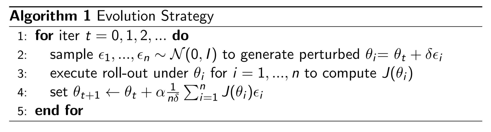
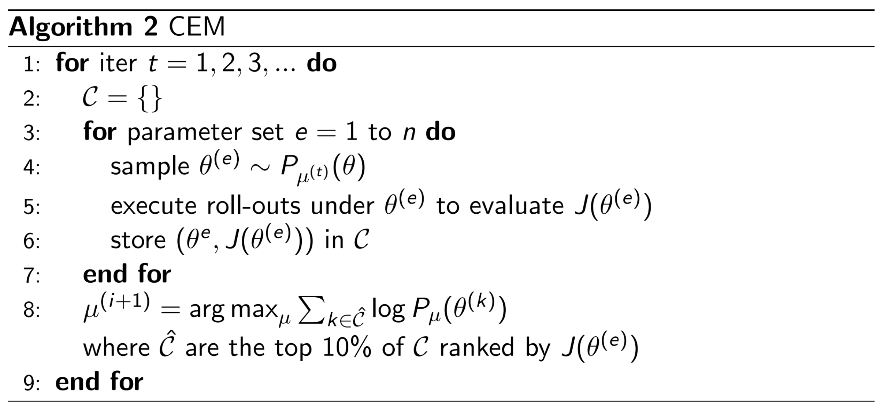
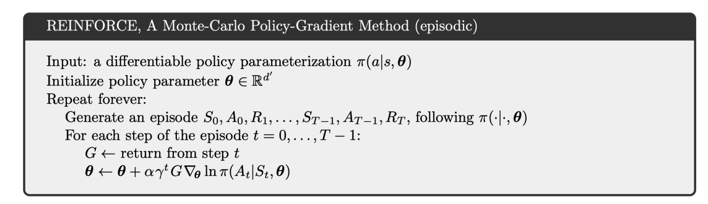
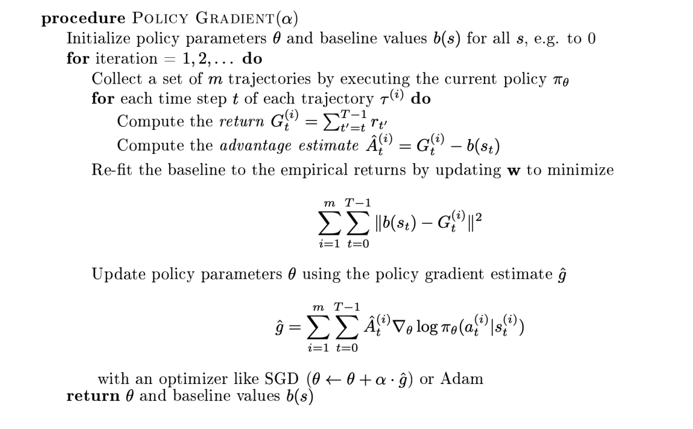
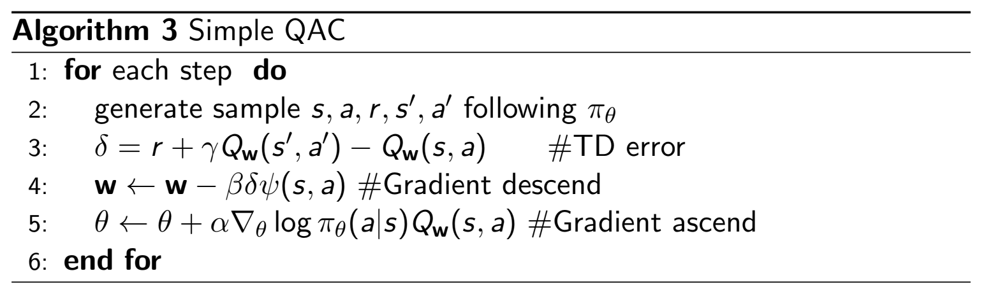
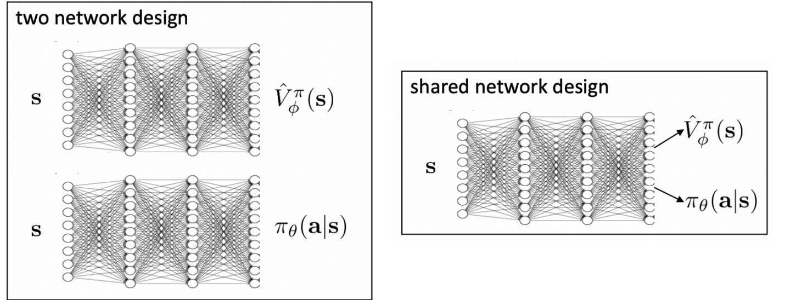
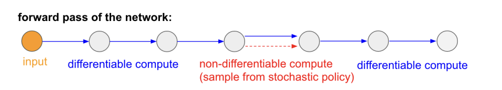
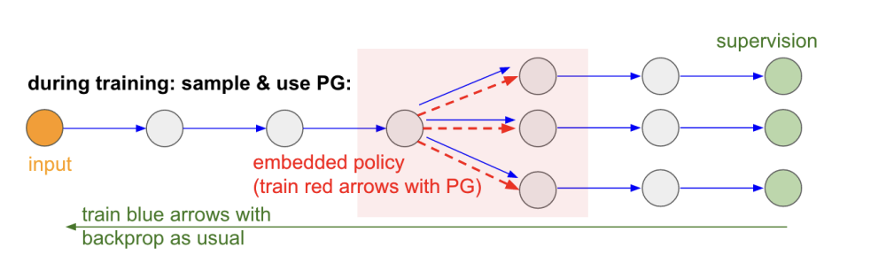
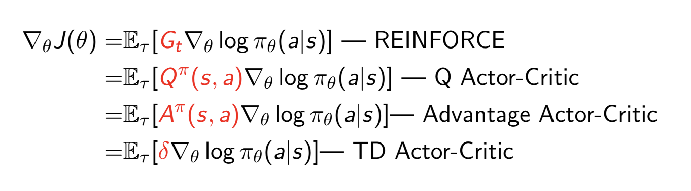

# Policy Gradient and Actor-Critic
## Introduction on Policy Function versus Value Function
- Previous approaches focused more on *value-based reinforcement learning* where the goal was to approximate either the value function or the state-action value function ($V_\theta$ or $Q_\theta$)
  - From this, a policy is generated directly from the value function using some sort of greedy method (e.g. $\epsilon$-greedy or just pure greedy)
- A different approach is to just *parameterize* the policy function and learn it *directly*
  - $\pi_\theta(a|s)$
  - The motivation here is since we just need *only the policy* for decision making, it would make sense to just optimize it directly
- Another approach may involve learning *both* the policy and value function - **actor-critic** methods
## Policy-Based Reinforcement Learning
- Tradeoffs:
  - Advantages:
    - Better convergence properties
    - Effective in high-dimensional action spaces
    - Capable of learning stochastic policies
  - Weaknesses:
    - Typically only converges to a *local optimum*
    - Evaluating a policy is inefficient and has high variance
- Types of Policies:
  - Deterministic: Given a state, always returns the same action to take (discrete or continuous)
  - Stochastic: Given a state, return a probability distribution of the actions (if discrete) or a probability density function of actions (if continuous)
- Objective of Optimizing Policy:
  - Given $\pi_\theta(a|s)$, find the best $\theta$
  - In episodic environments, use the start value - evaluate how the policy performs in the environment based on a rollout
    - $J_1(\theta) = V^{\pi_\theta}(s_1)$
  - In continuing environments:
    - Use average value: $J_{avV}(\theta) = \sum_s d^{\pi_\theta} V^{\pi_\theta}(s)$
    - Average reward per time step: $J_{avR}(\theta) = \sum_s d^{\pi_\theta}(s) \sum_a \pi_\theta(a|s) R(s, a)$
    - $d^{\pi_\theta}$ is the stationary distribution of Markov chain for $\pi_\theta$
  - In practice, since we do not know the stationary distribution and are not trying to estimate the value function, we can just use the rewards gathered from a rollout
    - $J(\theta) = \mathbb{E}_{\tau \sim \pi_\theta} [\sum_{t} r(s_t, a_t)] \approx \frac{1}{m} \sum_m \sum_t r(s_{t, m}, a_{t, m})$
        - $\tau$ is a trajectory $(s_1, a_1, r_1, ..., s_T, a_T, r_T)$
  - Thus, the goal of policy-based reinforcement learning is to find:
    - $\theta^* = \argmax_\theta \mathbb{E}_{\tau \sim \pi_\theta} [\sum_{t} r(s_t, a_t)]$
    - This is not directly differentiable because $\tau$ is sampled from $\pi_\theta$
  - Ways to Maximize $J(\theta)$:
    - If $J(\theta)$ is differentiable:
      - Gradient Ascent
      - Conjugate Gradient
      - Quasi-Newton
    - If $J(\theta)$ is not differentiable:
      - Evolution Strategy:
        - Treat $J(\theta)$ as a block box score function
        - 
          - "Mutations" that yield a higher rollout reward are weighted higher when updating the policy weights
      - Cross-Entropy Method (CEM)
        - This is similar to the evolution strategy, but it considers only the top 10%-20% of perturbations
        - 
          - $\mu$ is the parameter for the noise distribution
      - Finite Difference
        - $\frac{\partial J(\theta)}{\partial \theta_k} \approx \frac{J(\theta + \delta u_k) - J(\theta)}{\delta}$
- Computing the Policy Gradient Analytically:
  - Assume $\pi_\theta$ is differentiable whenever it is non-zero
  - $\nabla_\theta \pi_\theta(a|s)$
  - Use likelihood ratio trick:
    - $\nabla_\theta \pi_\theta (a|s) = \pi_\theta(a|s) \frac{\nabla \pi_\theta(a|s)}{\pi_\theta(a|s)} = \pi_\theta(a|s) \nabla \log \pi_\theta(a|s)$
    - The *score function* is $\nabla \log \pi_\theta(a|s)$, which essentially indicates the steepness of the log-likelihood function
  - Consider one-step MDPs:
    - Start in state $s \sim d(s)$, and terminate after one step with reward $r = R(s, a)$
    - $J(\theta) = \mathbb{E}_{\pi_\theta}[r] = \sum_{s \in S} d(s) \sum_{a \in A} \pi_\theta (a |s) r$
    - $\nabla_\theta J(\theta) = \sum_{s \in S} d(s) \sum_{a \in A} \pi_\theta (a|s) \nabla_\theta \log \pi_\theta (a|s) r = \mathbb{E}_{\pi_\theta}[r \nabla_\theta \log \pi_\theta (a|s)]$
      - Think of this as akin to the log-likelihood of the actions given states $(s, a)$, though weighted by the reward
      - Training data is $(s, a, r)_N$
- To actually describe $\pi_\theta$, given features $\phi(s, a)$ we can:
  - Use Softmax in the discrete case: $\pi(a|s) = \frac{\exp (\phi(s, a)^T \theta)}{\sum_{a'} \exp (\phi(s, a')^T \theta)}$
    - Score function: $\nabla_\theta \log \pi(a|s) = \phi(s, a) - \mathbb{E}_{\pi_\theta} [\phi(s, .)]$
  - Use a Gaussian in the continuous case
    - Mean is $\mu(s) = \phi(s)^T \theta$
    - Variance can be fixed or can be parameterized
    - Policy: $a \sim \mathcal{N}(\mu(s), \sigma^2)$
    - Score function: $\nabla_\theta \log \pi_\theta (a | s) = \frac{(a - \mu(s)) \phi(s)}{\sigma^2}$
## Monte-Carlo Policy Gradient
- Policy Gradient for Multi-Step MDPs:
  - Sample trajectory: $\tau = (s_0, a_0, r_1, ..., s_{T - 1}, a_{T - 1}, r_{T}, s_{T}) \sim P(\pi_\theta, P(s_{t+1} | s_t, a_t))$
  - $R(\tau) = \sum_{t=0}^T R(s_t, a_t)$
  - $J(\theta) = \mathbb{E}_{\pi_\theta} = [\sum_{t=0}^T R((s_t, a_t))] = \sum_\tau P(\tau ; \theta) R(\tau)$
    - $P(\tau ; \theta)$ is the probability over trajectories when executing the policy $\pi_\theta$
      - We do not know this in practice
    - Find $\theta^* = \argmax{\theta} J(\theta) = \argmax{\theta} \sum_\tau P(\tau ; \theta) R(\tau)$
    - Use log-likelihood trick for gradient:
      - $\nabla_\theta J(\theta) = \sum_\tau P(\tau ; \theta) R(\tau)$
      - $= \sum_\tau \nabla P(\tau;\theta) R(\tau)$
      - $= \frac{P(\tau ; \theta)}{P(\tau ; \theta)} \nabla_\theta P(\tau ; \theta) R(\tau)$
      - $= P(\tau ; \theta) R(\tau) \nabla_\theta \log P(\tau ; \theta)$
      - $\approx \frac{1}{m} \sum_{i = 1}^m R(\tau_i) \nabla_\theta \log P(\tau_i ; \theta)$
        - Specifically, we can decompose $\nabla_\theta \log P(\tau ; \theta)$:
        - $\nabla_\theta \log P(\tau ; \theta) = \nabla_\theta \log (\mu(s_0) \prod_{t=0}^{T-1} \pi_\theta(a_t | s_t) p(s_{t+1} | s_t, a_t))$
          - $\mu$ is the initial distribution, which we do not know
          - $p(s | s, a)$ is the transition distribution, which we also do not know
        - $=\nabla_\theta[\log \mu(s_0) + \sum_{t=0}^{T-1} \log \pi_\theta(a_t | s_t) + \log p(s_{t+1} | s_t, a_t)]$
        - $= \sum_{t=0}^{T-1} \nabla_\theta \log \pi_\theta(a_t | s_t)$
          - The unknown components have been eliminated
      - $\nabla_\theta J(\theta) \approx \frac{1}{m} \sum_{i = 1}^m R(\tau_i) \sum_{t = 0}^{T - 1} \nabla_\theta \log \pi_\theta(a^i_t | s^i_t)$
- Understanding $\nabla_\theta \mathbb{E}_{x \sim p(x; \theta)}[f(x)] = \mathbb{E}_x[f(x) \nabla_\theta \log p(x; \theta)]$
  - View this as shifting the distribution $p$ through its parameter $\theta$ to let its future samples $x$ achieve *higher scores* as judged by the score function $f(x)$ - in our case, this score function is the reward
  - The direction of $f(x) \nabla_\theta \log p(x;\theta)$ pushes up the log probability of the sample in proportion to how good it is
  - Think of this as similar to maximum likelihood estimation but *good actions are made more likely* whereas *bad actions are made less likely*
- An issue with the policy gradient currently is that it has high variance (though it is unbiased)
  - One fix: **Temporal Causality**: Policy cannot affect rewards in the past, so the sum of rewards in the objective should *not* include rewards achieved before the time step at which the policy is queried
    - $\nabla_\theta J(\theta) = \mathbb{E}_\tau[\sum_{t = 0}^{T - 1}\nabla \log \pi_\theta(a_t |s_t) \sum _{\textcolor{red}{\bold{t' =t}}}^{T-1}r_{\bold{t'}}] = \mathbb{E}_\tau [\sum_{t=0}^{T-1} G_t \cdot \nabla_\theta \log \pi_\theta(a_t | s_t)]$
      - $G_t$ is the reward-to-go of a trajectory at step $t$, or a sample estimate of the $Q$ function
    - $\nabla_\theta J(\theta) \approx \frac{1}{m} \sum_{t=0}^{T-1} \sum_{i = 1}^m G^{(i)}_t \cdot \nabla_\theta \log \pi_\theta(a^i_t | s^i_t)$
- REINFORCE Algorithm:
  - 
- Another improvement to reduce variance can be to use a *baseline*
  - We can subtract a baseline $b$ from $G_t$ to reduce variance
  - $\nabla_\theta J(\theta) = \mathbb{E}_\tau [\sum_{t = 0}^{T - 1} (G_t -b) \cdot \nabla \log \pi_\theta(a_t |s_t)]$
  - A good baseline is just the expected return: $b = \mathbb{E}[r_t + r_{t+1} + ... + r_{T-1}]$
    - A policy that has *better than average return* should be promoted
  - 
    - $\bold{w}$ is a parameter for the baseline
    - In practical implementations, we do not compute the gradients individually but rather *batch them*
      - $L(\theta) = \sum_t \hat{A}_t \log \pi_\theta (a_t | s_t ; \theta)$
      - $\hat{g} = \nabla_\theta L(\theta)$
      - Joint Loss (Baseline and Policy Gradient): $L(\theta, \bold{w}) = \sum_t (\hat{A_t} \log \pi_\theta (a_t | s_t ; \theta) - ||b(s_t) - \hat{R}_t||^2)$
        - Call autograd on this
## Actor-Critic Methods
- The update for policy gradient is $\nabla_\theta J(\theta) = \mathbb{E}_{\pi_\theta} [\sum _{t=0}^{T-1} G_t \cdot \nabla_\theta \log \pi_\theta (a_t | s_t)]$, and in practice $G_t$ is a sample from the Monte Carlo policy gradient which is unbiased but noisy estimate of $Q^{\pi_\theta}$
  - Instead, we can use a *critic* to estimate the action-value function: $Q_w(s,a) \approx Q^{\pi_\theta}(s, a)$
  - The update then becomes: $\nabla_\theta J(\theta) = \ \mathbb{E}_{\pi_\theta} [\sum_{t=0}^{T-1}Q_w(s_t, a_t) \cdot \nabla_\theta \log \pi_\theta (a_t | s_t)]$
    - There is an **actor**, which is the policy function used to generate the action (associated with $\theta$)
    - There is also a **critic**, which is the value function used to evaluate the reward of the actions (associated with $w$)
- To estimate the critic, we can use policy evaluation - that is, determine how good $\pi_\theta$ is under current parameter $\theta$
  - This can be done with Monte-Carlo policy evaluation, Temporal-Difference learning, or Least-Squares policy evaluation
- Simple Action-Value Actor-Critic Algorithm:
  - Use linear value function approximation: $Q_\bold{w} (s,a) = \psi(s, a)^T \bold{w}$
  - 
- Some designs can *share the weights* for the actor and the critic since many of the features are often shared (both take in the state)
  - 
- **Compatible Function Approximation**:
  - If the following two conditions are satisfied:
    - Value function approximator is compatible to the policy: $\nabla_w Q_w (s, a) = \nabla_\theta \log \pi_\theta(a|s)$
    - Value function parameters $w$ minimize the mean-squared error: $\epsilon(w) = E_{\pi_\theta}[(Q^{\pi_\theta}(s,a) - Q_w(s,a))^2]$
  - Then the policy gradient is exact:
    - $\nabla_\theta J(\theta) = \mathbb{E}_{\pi_\theta} [Q_w(s,a) \nabla_\theta \log \pi_\theta(a|s)]$
- The variance of actor-critic can similarly be reduced by incorporating a baseline
  - The state-value function can serve as a great baseline
  - $Q^{\pi, \gamma}(s, a) = \mathbb{E}_\pi [r_1 + \gamma r_2 + ... | s_1 = s, a_1 = a]$
  - $V^{\pi, \gamma}(s) = \mathbb{E}_\pi [r_1 + \gamma r_2 + ... | s_1 = s] = \mathbb{E}_{a \sim \pi} [Q^{\pi, \gamma}(s, a)]$
  - Advantage: $A^{\pi, \gamma}(s, a) = Q^{\pi, \gamma}(s, a) - V^{\pi, \gamma}(s)$
    - A positive advantage indicates that the action was better than the 'average' action, and so it should be encouraged in the policy
  - $\nabla_\theta J(\theta) = \mathbb{E}_{\pi_\theta} [A^{\pi}(s, a) \nabla_\theta \log \pi_\theta(a|s)]$
    - Naively, now we need two function approximators for the critic (for the value and the state-action value)
  - Improvement: 
    - To estimate $V$, recall that the TD error is $\delta^{\pi_\theta} = r(s, a) + \gamma V^{\pi_\theta}(s') - V^{\pi_\theta}(s)$
    - This TD error is actually an *unbiased estimate of the advantage function*:
      - $\mathbb{E}_{\pi_\theta}[\delta^{\pi_\theta} | s, a] = \mathbb{E}_{\pi_\theta} [r + \gamma V^{\pi}(s') | s, a] - V^{\pi_\theta}(s)$
      - $= Q^{\pi_\theta}(s, a) - V^{\pi_\theta}(s)$
      - $= A^{\pi_\theta}(s, a)$
    - Thus, with only one set of parameters for the critic:
      - $\nabla_\theta J(\theta) = \mathbb{E}_{\pi_\theta} [\delta^{\pi_\theta}\nabla_\theta \log \pi_\theta(a|s)]$
- Actor-critic methods can vary between using Monte Carlo, Temporal Difference, or an n-step variation between the two
  - $n=1$ (TD): $\hat{A}^{(1)}_t = r_{t+1} + \gamma v(s_{t+1}) - v(s_t)$
    - Low variance but high bias
  - $n=2$: $\hat{A}^{(2)}_t = r_{t+1} + \gamma r_{t+2} + \gamma^2 v(s_{t+2}) - v(s_t)$
  - $n=\infty$ (Monte Carlo): $\hat{A}^{(\infty)}_t = r_{t+1} + \gamma r_{t+2} + ... + \gamma^{T-t-1}r_T - v(s_t)$
    - High variance but low bias
- The time scaling can differ for the actor and critic:
  - Critic: $V_\kappa (s) = \psi(s)^T \kappa$
    - Monte Carlo: $\Delta \kappa = \alpha (\textcolor{red}{G_t} - V \kappa (s)) \psi(s)x$
    - TD(0): $\Delta \kappa = \alpha (\textcolor{red}{r + \gamma V_\kappa (s')} - V_\kappa(s))\psi(s)$
    - k-step: $\Delta \kappa = \alpha(\textcolor{red}{\sum_{i=0}^k \gamma^i r_{t+i} + \gamma^k V_\kappa (s_t + k)} - V_\kappa (s_t))\psi(s)$
  - Actor: $\nabla_\theta J(\theta) = \mathbb{E}_{\pi_\theta}[\nabla_\theta \log \pi_\theta (a|s) A^{\pi_\theta}(s, a)]$
    - Monte Carlo: $\Delta \theta = \alpha (\textcolor{red}{G_t} - V_\kappa (s_t))\nabla_\theta \log \pi_\theta (s_t, a_t)$
    - TD(0): $\Delta \theta = \alpha (\textcolor{red}{r + \gamma V_\kappa (s_{t+1})} - V_\kappa(s_t))\nabla_\theta \log \pi_\theta (s_t, a_t)$
    - k-step: $\Delta \theta = \alpha (\textcolor{red}{\sum_{i=0}^k \gamma^i r_{t+i} + \gamma^k V_\kappa (s_t + k)} - V_\kappa (s_t))\nabla_\theta \log \pi_\theta (s_t, a_t)$
- Policy Gradient is **on-policy** because there is on-policy sampling ($\tau \sim \pi_\theta$)
  - This implies the learning is *stable* but may not necessarily be *sample efficient* since we cannot use old trajectories
  - However, policy gradient is useful in that it can allow for non-differentiable computation to be overcome since the samples that encourage good outcomes can be collected from otherwise non-differentiable stochastic processes
    - 
    - 
## Misc
- Summary of policy gradient methods
  - 
  - Policy evaluation (MC / TD / k-step) can be used to estimate $Q, A, V$
- REINFORCE on CartPole
  -     class Policy(nn.Module):
            def __init__(self):
                super(Policy, self).__init__()
                self.affine1 = nn.Linear(4, 128)
                self.dropout = nn.Dropout(p=0.6)
                self.affine2 = nn.Linear(128, 2)

                self.saved_log_probs = []
                self.rewards = []

            def forward(self, x):
                x = self.affine1(x)
                x = self.dropout(x)
                x = F.relu(x)
                action_scores = self.affine2(x)
                return F.softmax(action_scores, dim=1)

        policy = Policy()
        optimizer = optim.Adam(policy.parameters(), lr=1e-2)
        eps = np.finfo(np.float32).eps.item()

        def select_action(state):
            state = torch.from_numpy(state).float().unsqueeze(0)
            probs = policy(state)
            m = Categorical(probs)
            action = m.sample()
            policy.saved_log_probs.append(m.log_prob(action))
            return action.item()

        def finish_episode():
            R = 0
            policy_loss = []
            returns = []
            for r in policy.rewards[::-1]:
                R = r + args.gamma * R
                returns.insert(0, R)
            returns = torch.tensor(returns)
            returns = (returns - returns.mean()) / (returns.std() + eps)
            for log_prob, R in zip(policy.saved_log_probs, returns):
                policy_loss.append(-log_prob * R)
            optimizer.zero_grad()
            policy_loss = torch.cat(policy_loss).sum()
            policy_loss.backward()
            optimizer.step()
            del policy.rewards[:]
            del policy.saved_log_probs[:]

        def main():
            running_reward = 10
            for i_episode in count(1):
                state, _ = env.reset(seed=args.seed + i_episode)
                ep_reward = 0
                for t in range(1, 10000):  # Don't infinite loop while learning
                    action = select_action(state)
                    state, reward, terminated, truncated, _ = env.step(action)
                    done = np.logical_or(terminated, truncated)
                    if args.render:
                        env.render()
                    policy.rewards.append(reward)
                    ep_reward += reward
                    if done:
                        break

                running_reward = 0.05 * ep_reward + (1 - 0.05) * running_reward
                finish_episode()
                if i_episode % args.log_interval == 0:
                    print('Episode {}\tLast reward: {:.2f}\tAverage reward: {:.2f}'.format(
                        i_episode, ep_reward, running_reward))
                if running_reward > env.spec.reward_threshold:
                    print("Solved! Running reward is now {} and "
                          "the last episode runs to {} time steps!".format(running_reward, t))
                    break
- Actor Critic on Pong
  -     class AC(nn.Module):
            def __init__(self, num_actions=2):
                super(AC, self).__init__()
                self.affine1 = nn.Linear(6400, 200)
                self.action_head = nn.Linear(200, num_actions)  # action 1: static, action 2: move up, action 3: move down
                self.value_head = nn.Linear(200, 1)

                self.num_actions = num_actions
                self.saved_log_probs = []
                self.rewards = []

            def forward(self, x):
                x = F.relu(self.affine1(x))
                action_scores = self.action_head(x)
                state_values = self.value_head(x)
                return F.softmax(action_scores, dim=-1), state_values

            def select_action(self, x):
                x = Variable(torch.from_numpy(x).float().unsqueeze(0))
                if is_cuda: x = x.cuda()
                probs, state_value = self.forward(x)
                m = Categorical(probs)
                action = m.sample()

                self.saved_log_probs[-1].append((m.log_prob(action), state_value))
                return action

        # built policy network
        policy = AC()
        if is_cuda:
            policy.cuda()

        # check & load pretrain model
        if os.path.isfile('ac_params.pkl'):
            print('Load Actor Critic Network parametets ...')
            if is_cuda:
                policy.load_state_dict(torch.load('ac_params.pkl'))
            else:
                policy.load_state_dict(torch.load('ac_params.pkl', map_location=lambda storage, loc: storage))

        # construct a optimal function
        optimizer = optim.RMSprop(policy.parameters(), lr=args.learning_rate, weight_decay=args.decay_rate)

        def finish_episode():
            R = 0
            policy_loss = []
            value_loss = []
            rewards = []
            for episode_id, episode_reward_list in enumerate(policy.rewards):
                for i, r in enumerate(episode_reward_list):
                    if i == len(episode_reward_list) - 1:
                        R = torch.scalar_tensor(r)
                    else:
                        R = r + args.gamma * policy.saved_log_probs[episode_id][i + 1][1]
                    if is_cuda:
                        R = R.cuda()
                    rewards.append(R)
            flatten_log_probs = [sample for episode in policy.saved_log_probs for sample in episode]
            assert len(flatten_log_probs) == len(rewards)
            for (log_prob, value), reward in zip(flatten_log_probs, rewards):
                advantage = reward - value  # A(s,a) = r + gamma V(s_t+1) - V(s_t)
                advantage = advantage.detach()
                policy_loss.append(- log_prob * advantage)  # policy gradient
                value_loss.append(F.smooth_l1_loss(value.reshape(-1), reward.reshape(-1)))  # value function approximation
            optimizer.zero_grad()
            policy_loss = torch.stack(policy_loss).sum()
            value_loss = torch.stack(value_loss).sum()
            loss = policy_loss + args.value_loss_coef * value_loss
            if is_cuda:
                loss.cuda()
            loss.backward()
            torch.nn.utils.clip_grad_norm_(policy.parameters(), args.max_grad_norm)  # gradient clip
            optimizer.step()

            # clean rewards and saved_actions
            del policy.rewards[:]
            del policy.saved_log_probs[:]

        # Main loop
        running_reward = None
        reward_sum = 0
        for i_episode in count(1):
            state, _ = env.reset(seed=args.seed + i_episode)
            prev_x = None
            policy.rewards.append([])  # record rewards separately for each episode
            policy.saved_log_probs.append([])
            for t in range(10000):
                cur_x = prepro(state)
                x = cur_x - prev_x if prev_x is not None else np.zeros(D)
                prev_x = cur_x
                action = policy.select_action(x)
                action_env = action + 2
                state, reward, terminated, truncated, _ = env.step(action_env)
                done = np.logical_or(terminated, truncated)
                reward_sum += reward

                policy.rewards[-1].append(reward)
                if done:
                    # tracking log
                    running_reward = reward_sum if running_reward is None else running_reward * 0.99 + reward_sum * 0.01
                    print('Actor Critic ep %03d done. reward: %f. reward running mean: %f' % (
                        i_episode, reward_sum, running_reward))
                    reward_sum = 0
                    break

            # use policy gradient update model weights
            if i_episode % args.batch_size == 0 and test == False:
                finish_episode()

            # Save model in every 50 episode
            if i_episode % 50 == 0 and test == False:
                print('ep %d: model saving...' % (i_episode))
                torch.save(policy.state_dict(), 'ac_params.pkl')