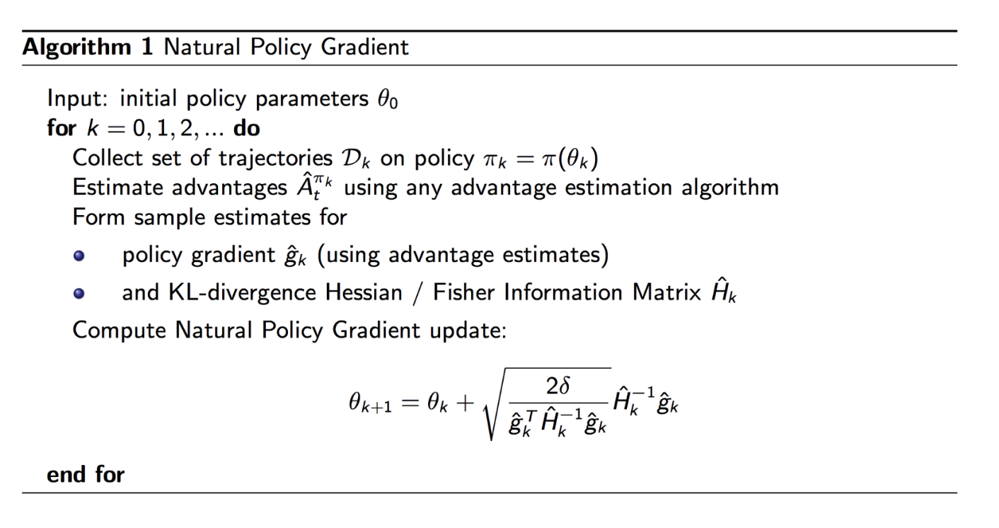
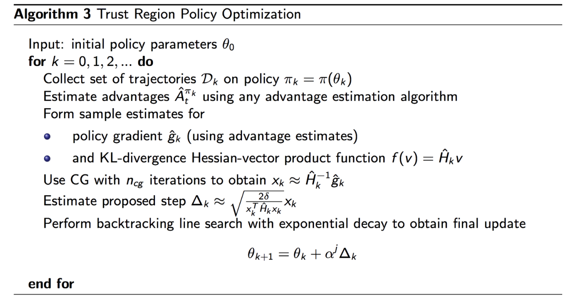
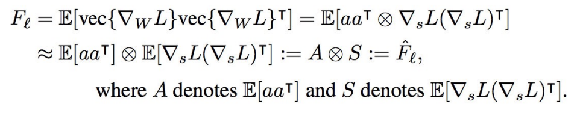
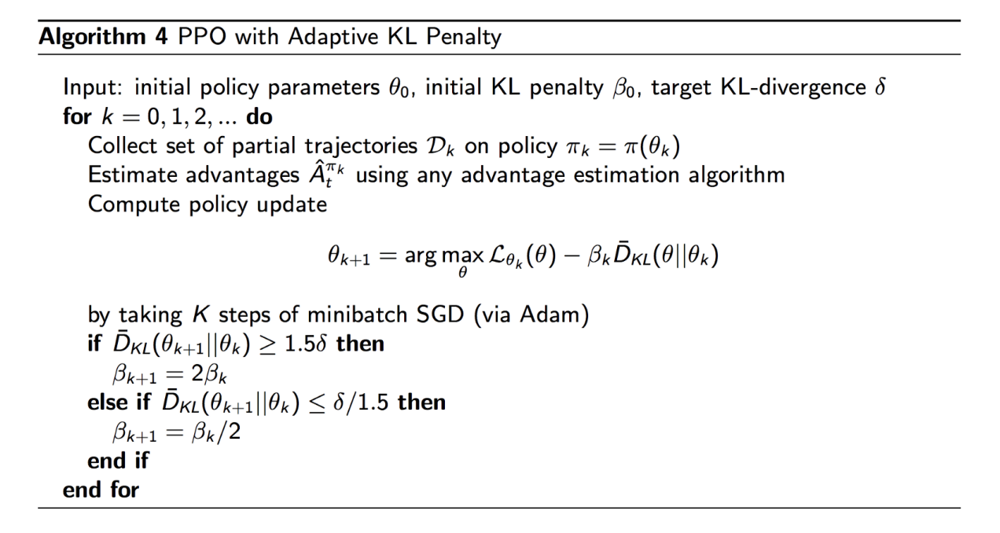
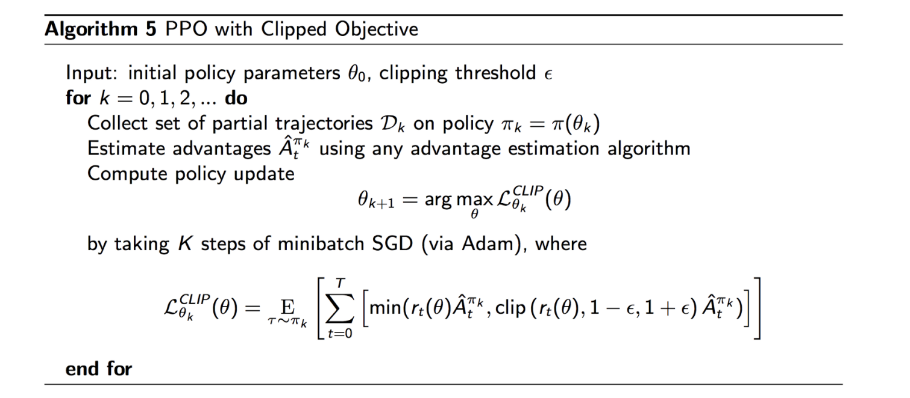

# Policy Gradient II
- Some problems with normal policy gradient:
  - Policy gradient is **on policy**, which means there is poor sample efficiency since we cannot use the rollouts collected from previous trajectories
  - Large policy updates or improper step sizes can destroy the training - if there is too far of a step, then there is a bad policy which results in *bad data collection*
    - This is not a problem in other types of learning (supervised learning) because learning and data are independent; in reinforcemnet learning, though, the data collected (trajectories) is based on the policy learned
    - There may be cases where the bady policy cannot be recovered from, which can collapse the training
## Stochastic Policy-Based Approaches
- One way to to turn policy gradient into an *off-policy* approach is to use **importance sampling**
  - Recall that importance sampling calculates the expected value of $f(x)$ where $x$ has a data distribution $p$
    - Sample from another distribution $q$ (which is usually close to $p$) and use the probability ratio between $p$ and $q$ to re-calibrate the result
    - $\mathbb{E}_{x \sim p}[f(x)] = \mathbb{E}_{x \sim q} [\frac{p(x)}{q(x)}f(x)]$
  - Policy Objective:
    - $J(\theta) = \mathbb{E}_{s, a \sim \pi_\theta}[r(s, a)] = \mathbb{E}_{s, a \sim \hat{\pi}}[\frac{\pi_\theta(a_t |s_t)}{\pi_{\theta_{old}}(a_t |s_t)} R_t]$
      - It is easy to 'compute' the policy, but harder to sample from it
      - The 'old' (surrogate) policy can be easily sampled because we have access to old trajectories
  - However, we need to be careful to limit excessive differences between $\pi_\theta$ and $\pi_{\theta_{old}}$
    - One way is to use KL divergence to measure the distance between two policies:
      - $KL(\pi_{\theta_{old}} || \pi_\theta) = \sum_a \pi_{\theta_{old}}(a |s) \log \frac{\pi_{\theta_{old}}(a | s)}{\pi_\theta(a | s)}$
    - $J(\theta ;\theta_{old}) = \mathbb{E}_t [\frac{\pi_\theta (a_t | s_t)}{\pi_{\theta_{old}}(a_t | s_t)} R_t]$ subject to $KL(\pi_{\theta_{old}} || \pi_\theta) \leq \delta$
    - These 'trust regions' are the intuition behind algorithms such as TRPO and PPO; it is essentially limiting the parameter search within a region controlled by $\delta$ for each learning step
- Consider policy gradient in **parameter space** with a Euclidian metric:
  - $d^* = \nabla_\theta J(\theta) = \lim_{\epsilon \rightarrow 0} \frac{1}{\epsilon} \argmax J(\theta + d)$, s.t. $||d|| \leq \epsilon$
    - This is sensitive to the parameterization of the policy function
  - **Natural Policy Gradient** is steepest ascent in **distribution space (policy output)**
    - $d^* = \argmax J(\theta +d)$, s.t. $KL[\pi_\theta || \pi_{\theta + d}] =c$
  - It can be shown that the second-order Taylor expansion of KL-Divergence is:
    - $KL[\pi_\theta || \pi_{\theta + d}] \approx \frac{1}{2}d^T Fd$ where $F$ is the Fisher Information Matrix as the second order derivative of KL divergence 
      - $F = E_{\pi_\theta (s, a)}[\nabla \log \pi_\theta (s, a) \nabla \log \pi_\theta (s, a)^T]$
    - $d^* = \argmax J(\theta +d)$, s.t. $KL[\pi_\theta || \pi_{\theta + d}] =c = \argmax_d J(\theta + d) - \lambda (KL[\pi_\theta || \pi_{\theta + d}] -c) \approx \argmax_d J(\theta) + \nabla_\theta J(\theta)^Td - \frac{1}{2}\lambda d^T Fd + \lambda c$
      - Solution: $d = \frac{1}{\lambda}F^{-1} \nabla_\theta J(\theta)$
      - $\theta_{t + 1} = \theta_t + F^{-1} \nabla_\theta J(\theta)$
        - This is a **second-order** optimization method, which can be more accurate compared to first order (stochastic) methods - though obviously at the tradeoff of being harder to calculate
### Trust Region Policy Optimization
- Objective of TRPO:
  - $J_{\theta_{old}}(\theta) = \mathbb{E}_t [\frac{\pi_\theta (a_t | s_t)}{\pi_{\theta_{old}}(a_t | s_t)} R_t]$ subject to $KL(\pi_{\theta_{old}} || \pi_\theta) \leq \delta$
- Apply the natural policy gradient to TRPO:
  - $J(\theta ; \theta_t) \approx g^T (\theta - \theta_t)$
    - $g = \nabla_\theta J_{\theta_t}(\theta)$
  - $KL(\theta || \theta_t) \approx \frac{1}{2}(\theta - \theta_t)^T H(\theta - \theta_t)$ 
    - $H = \nabla^2_\theta KL(\theta || \theta_t)$
  - The objective becomes:
    - $\theta_{t + 1} = \argmax_\theta g^T(\theta - \theta_t)$ such that $\frac{1}{2}(\theta - \theta_t)^T H (\theta - \theta_t) \leq \delta$
    - Quadratic Solution: $\theta_{t+ 1} = \theta_t + \sqrt{\frac{2\delta}{g^T H^{-1}g}}H^{-1}g$
      - $H$ is the Fisher Information Matrix which can be computed explicitly as:
        - $H = \nabla^2_\theta KL(\theta || \theta_t) = E_{a, s \sim \pi_{\theta_t}}[\nabla_\theta \log \pi_{\theta_t}(a | s) \nabla_\theta \log \pi_{\theta_t}(a | s)^T]$
    - The learning rate $\delta$ can be thought of as choosing a step size that is *normalized with respect to the change in the policy*
      - Any parameter update will not significantly change the output of the policy network
      - This makes sense since $\delta$ is derived from our KL constraint of how much we want to limit the divergence between the new policy and old policy
    - 
- One issue with natural policy gradient is that the Fisher Information Matrix is quite expensive to compute
  - In practice, TRPO estimates the term $x = H^{-1}g$ by solving the linear equation $Hx = g$
    - This can be optimized as $\min_x \frac{1}{2}x^THx - g^Tx$
      - This is because $Ax = b$ is equivalent to solving $x = \argmin_x f(x) = \frac{1}{2} x^T Ax  - b^Tx$ since $f'(x) = Ax - b =0$
  - Conjugate gradient methods can be used to solve this
- 
- Issues with TRPO:
  - Scalability
    - Computing $H$ every time for the current policy model is expensive
    - Requires a large batch of rollouts to approximate $H$
      - $H = E_{a, s \sim \pi_{\theta_t}}[\nabla_\theta \log \pi_{\theta_t}(a | s) \nabla_\theta \log \pi_{\theta_t}(a | s)^T]$
    - Conjugate Gradient makes implementation more complicated
  - Performance:
    - Does not work well on some tasks compared to DQN
### Actor-Critic using Kronecker-factored Trust Region
- The goal is to try to make TRPO more *scalable*
  - This is done by reducing the complexity of calculating the Fisher Information Matrix using the Kronecker-factored approximation curvature (K-FAC):
    - $F = E_{x \sim \pi_{\theta_t}} [(\nabla_\theta \log \pi_{\theta_t}(x))^T (\nabla_\theta \log \pi_{\theta_t}(x))]$
    - Decompose the calculation into a *layer-wise* approximation
    - 
### Proximal Policy Optimization
- The loss function of Natural Policy Gradient and TRPO is:
  - $\max_\theta \mathbb{E}_t [\frac{\pi_\theta (a_t | s_t)}{\pi_{\theta_{old}}(a_t | s_t)}A_t]$ subject to $\mathbb{E}_t [KL[\pi_{\theta_{old}}(\cdot |s_t), \pi_\theta (\cdot | s_t)]] \leq \delta$
  - In unconstrained form:
    - $\max_\theta \mathbb{E}_{\pi_{\theta_{old}}} [\frac{\pi_\theta (a_t | s_t)}{\pi_{\theta_{old}}(a_t | s_t)}A_t] - \beta \mathbb{E}_{\pi_{\theta_{old}}}[KL[\pi_{\theta_{old}}(\cdot |s_t), \pi_\theta (\cdot | s_t)]]$
- With PPO, the adaptive KL penalty is included so that optimization has a better insurance that optimization is within a trust region
  - 
    - The scale $\beta$ is adaptive, depending on how different the two distributions are (if there is barely any difference, then $\beta$ is reduced to encourage more updates, while if there is a high difference $\beta$ is increased to encourage less updates)
  - This is *easier to compute* than TRPO, and yields the same or better performance
- A more popular implementation of PPO leverages *clipping*
  - Let $r_t(\theta)$ denote the probability ratio $r_t(\theta) = \frac{\pi_\theta (a_t | s_t)}{\pi_{\theta_{old}}(a_t | s_t)}$
  - The different surrogate objectives are:
    - PG without trust region: $L_t(\theta) = r_t(\theta)\hat{A}_t$
    - KL Constraint: $L_t(\theta) = r_t(\theta)\hat{A}_t$ s.t. $KL[\pi_{\theta_{old}}, \pi_\theta] \leq \delta$
    - KL Penalty: $L_t(\theta) = r_t(\theta)\hat{A}_t - \beta KL[\pi_{\theta_{old}}, \pi_\theta]$
  - A new objective function is to *clip* the estimated advantage function if the new policy is far way from te old policy ($r_t$ is too large)
    - $L_t(\theta) = \min(r_t(\theta)\hat{A}_t, \text{clip}(r_t(\theta), 1 - \epsilon, 1 + \epsilon)\hat{A}_t)$
    - Typically, $\epsilon$ is 0.2
  - Clipping acts as a regularizer by removing incentives for the policy to change dramatically
    - When the advantage is positive, we encourage the action and so $\pi_\theta(a|s)$ increases, and when the advantage is negative, we discourage the action and so $\pi_\theta(a|s)$ decreases
      - $\frac{\pi_\theta(a|s)}{\pi_{\theta_{old}}(a|s)}$: When we encourage $\pi_\theta(a|s)$, the ratio *increases* by having it be greater than $\pi_{\theta_{old}}(a|s)$. When we discourage $\pi_\theta(a|s)$, the ratio *decreases* similarly by having it be less than $\pi_{\theta_{old}}(a|s)$
  - 
### Soft-Actor Critic (SAC)
- **Soft-Actor Critic** optimizes a *stochastic* policy in an off-policy way 
- The algorithm incorporates **entropy regularization** to maximize the tradeoff between expected return and entropy
  - Recall: $H(P) = E_{x \sim P}[- \log P(x)x]$
  - $\pi^* = \argmax E_{\tau \sim \pi}[\sum_t \gamma^t (R(s_t, a_t) + \alpha H(\pi(\cdot | s_t)))]$
- Bellman Equation:
  - $Q^\pi (s, a) = E_{s' \sim P, a' \sim \pi}[R(s, a) + \gamma (Q^\pi (s', a') + \alpha H(\pi(\cdot |s')))] = E_{s' \sim P, a' \sim \pi}[R(s, a) + \gamma (Q^\pi (s', a') - \alpha \log \pi(a' | s))]$
  - Sample Update: $Q^\pi(s, a) \approx r + \gamma (Q^\pi (s', \hat{a}') -\alpha \log \pi(\hat{a}' | s')), \hat{a}' \sim \pi(\cdot | s')$
- Soft-Actor Critic learns a policy $\pi_\theta$ and two Q-functions (like TD3), which have the loss:
  - $L(\phi_i, \mathcal{D}) = E[(Q_\phi(s, a) - y(r, s', d))^2]$
  - $y(r, s') = r + \gamma (\min_{k = 1, 2} Q_{\phi_{targ, j}} (s', \hat{a}') - \alpha \log \pi_\theta (\hat{a}' |s))$, where $\hat{a}' \sim \pi_\theta (\cdot |s)$
- The policy is learned from maximizing the expected future return plus future entropy:
  - $V^\pi (s) = E_{a \sim \pi} [Q^\pi (s, a)] + \alpha H(\pi(\cdot | s)) = E_{a \sim \pi} [Q^\pi (s, a) - \alpha \log \pi(\cdot | s)]$
  - One issue here is that the expectation is in terms of the policy - this can be difficult to compute
- To make maximizing the policy easier, we can reparamaterize $a$ as a sample from a squashed Gaussian policy:
  - $\hat{a}_\theta (s, \epsilon) = \tanh (\mu_\theta(s) + \sigma_\theta(s) \odot \epsilon), \epsilon \sim \mathcal{N}(0, I)$
  - This means the expectation over actions (which depends on policy parameters) can be rewritten as an expectation over noise (no dependence on parameters)
    - $E_{a \sim \pi_\theta}[Q^{\pi_\theta}(s, a) - \alpha \log \pi_\theta (a | s)] = E_{\epsilon \sim \mathcal{N}}[Q^{\pi_\theta}(s, \hat{a}_\theta (s, \epsilon)) -\alpha \log \pi_\theta (\hat{a}_\theta (s, \epsilon) | s)]$
    - Thus, the policy being optimized is now:
      - $\max_\theta E_{s \sim \mathcal{D}, \epsilon \sim \mathcal{N}}[\min_{j=1,2} Q_{\phi_j}(s, \hat{a}_\theta (s, \epsilon)) - \alpha \log_\theta (\hat{a}_\theta(s, \epsilon) | s)]$
## Deterministic Policy-Based Approaches
### Deep Deterministic Policy Gradient Algorithms
- **Deep Deterministic Policy Gradient** extends to DQN to environments with *continuous actions*
  - DQN: $a^* = \argmax_a Q^*(s,a)$
  - DDPG: $a^* = \argmax_a Q^*(s, a) \approx \argmax_\theta Q_\phi (s, \mu_\pi(s))$
    - There is a **deterministic** policy $\mu_\theta(s)$ that gives the action to maximize $Q_\phi(s, a)$
    - Since action $a$ is continuous, we assume the Q-function $Q_\phi(s, a)$ is *differentiable* with respect to $a$
- The objective is:
  - Q-Target: $y(r, s') = r + \gamma Q_{\phi_{targ}}(s', \mu_{\theta_{targ}}(s'))$
  - Q-Function Update: $\min E_{s, r, s', d \sim D}[(y(r, s') - Q_\phi(s, a))^2]$
  - Policy Update: $\max_\theta E_{s \sim D}[Q_\phi(s, \mu_\theta(s))]$
- This is still *off-policy*, as we are sampling from a *replay buffer* (as with DQN)
- Although the policy is deterministic, exploration can be managed with a behavior policy by adding noise to the actions generated by the deterministic policy
  - Also, if we want a stochastic policy, we can train a neural network to output a mean and a standard deviation (rather than a value), and then sample from the resulting Gaussian distribution
### Twin Delayed Deep Deterministic Policy Gradient
- An issue with vanilla DDPG is that it tends to *overestimate* Q-values, which leads to brittle training
- **Twin Delayed DDPG (TD3)** introduces three design changes:
  - *Clipped Double-Q learning*: Learn *two Q-functions* instead of one, and use the minimum of the two Q-values to form the targets in the Bellman error loss functions
    - $y(r, s') = r + \gamma \min Q_{\phi_{i, targ}}(s', a_{TD3}(s'))$
  - *Delayed Policy Updates*: Update the policy (and target networks) less frequently than the Q-function (recommended one policy update for every two Q-function updates)
  - *Target Policy Smoothing*: Add noise to target action, to make it harder for policy to exploit specific Q-function errors by smoothing out Q along changes in action
    - $a_{TD3}(s') = clip(\mu_{\theta, targ}(s') + clip(\epsilon, -c, c), a_{low}, a_{high}), \epsilon \sim \mathcal{N}(0, \sigma)$
## Misc
- PPO Implementation:
  -     class Model(A2C):
          def __init__(self, static_policy=False, env=None, config=None):
              super(Model, self).__init__(static_policy, env, config)
              
              self.num_agents = config.num_agents
              self.value_loss_weight = config.value_loss_weight
              self.entropy_loss_weight = config.entropy_loss_weight
              self.rollout = config.rollout
              self.grad_norm_max = config.grad_norm_max

              self.ppo_epoch = config.ppo_epoch
              self.num_mini_batch = config.num_mini_batch
              self.clip_param = config.ppo_clip_param

              self.optimizer = optim.Adam(self.model.parameters(), lr=self.lr, eps=1e-5)
              
              self.rollouts = RolloutStorage(self.rollout, self.num_agents,
                  self.num_feats, self.env.action_space, self.device, config.USE_GAE, config.gae_tau)

          def compute_loss(self, sample):
              observations_batch, actions_batch, return_batch, masks_batch, old_action_log_probs_batch, adv_targ = sample

              values, action_log_probs, dist_entropy = self.evaluate_actions(observations_batch, actions_batch)

              ratio = torch.exp(action_log_probs - old_action_log_probs_batch)
              surr1 = ratio * adv_targ
              surr2 = torch.clamp(ratio, 1.0 - self.clip_param, 1.0 + self.clip_param) * adv_targ
              action_loss = -torch.min(surr1, surr2).mean()

              value_loss = F.mse_loss(return_batch, values)

              loss = action_loss + self.value_loss_weight * value_loss - self.entropy_loss_weight * dist_entropy

              return loss, action_loss, value_loss, dist_entropy

          def update(self, rollout):
              advantages = rollout.returns[:-1] - rollout.value_preds[:-1]
              advantages = (advantages - advantages.mean()) / (
                  advantages.std() + 1e-5)

              value_loss_epoch = 0
              action_loss_epoch = 0
              dist_entropy_epoch = 0

              for e in range(self.ppo_epoch):
                  data_generator = rollout.feed_forward_generator(
                      advantages, self.num_mini_batch)

                  for sample in data_generator:
                      loss, action_loss, value_loss, dist_entropy = self.compute_loss(sample)

                      self.optimizer.zero_grad()
                      loss.backward()
                      torch.nn.utils.clip_grad_norm_(self.model.parameters(), self.grad_norm_max)
                      self.optimizer.step()

                      value_loss_epoch += value_loss.item()
                      action_loss_epoch += action_loss.item()
                      dist_entropy_epoch += dist_entropy.item()
              
              value_loss_epoch /= (self.ppo_epoch * self.num_mini_batch)
              action_loss_epoch /= (self.ppo_epoch * self.num_mini_batch)
              dist_entropy_epoch /= (self.ppo_epoch * self.num_mini_batch)
              total_loss = value_loss_epoch + action_loss_epoch + dist_entropy_epoch

              self.save_loss(total_loss, action_loss_epoch, value_loss_epoch, dist_entropy_epoch)

              return action_loss_epoch, value_loss_epoch, dist_entropy_epoch
        
        # IN TRAINER CODE
        for frame_idx in range(1, config.MAX_FRAMES+1):
          for step in range(config.rollout):
              with torch.no_grad():
                  values, actions, action_log_prob = model.get_action(model.rollouts.observations[step])
              cpu_actions = actions.view(-1).cpu().numpy()
      
              obs, reward, done, _ = envs.step(cpu_actions)

              episode_rewards += reward
              masks = 1. - done.astype(np.float32)
              final_rewards *= masks
              final_rewards += (1. - masks) * episode_rewards
              episode_rewards *= masks

              rewards = torch.from_numpy(reward.astype(np.float32)).view(-1, 1).to(config.device)
              masks = torch.from_numpy(masks).to(config.device).view(-1, 1)

              current_obs *= masks.view(-1, 1, 1, 1)
              update_current_obs(obs)

              model.rollouts.insert(current_obs, actions.view(-1, 1), action_log_prob, values, rewards, masks)
              
          with torch.no_grad():
              next_value = model.get_values(model.rollouts.observations[-1])

          model.rollouts.compute_returns(next_value, config.GAMMA)
              
          value_loss, action_loss, dist_entropy = model.update(model.rollouts)
          
          model.rollouts.after_update()

- TD3 Implementation:
  -     class Actor(nn.Module):
          def __init__(self, state_dim, action_dim, max_action):
            super(Actor, self).__init__()

            self.l1 = nn.Linear(state_dim, 256)
            self.l2 = nn.Linear(256, 256)
            self.l3 = nn.Linear(256, action_dim)
            
            self.max_action = max_action
            

          def forward(self, state):
            a = F.relu(self.l1(state))
            a = F.relu(self.l2(a))
            return self.max_action * torch.tanh(self.l3(a))

        class Critic(nn.Module):
          def __init__(self, state_dim, action_dim):
            super(Critic, self).__init__()

            # Q1 architecture
            self.l1 = nn.Linear(state_dim + action_dim, 256)
            self.l2 = nn.Linear(256, 256)
            self.l3 = nn.Linear(256, 1)

            # Q2 architecture
            self.l4 = nn.Linear(state_dim + action_dim, 256)
            self.l5 = nn.Linear(256, 256)
            self.l6 = nn.Linear(256, 1)

          def forward(self, state, action):
            sa = torch.cat([state, action], 1)

            q1 = F.relu(self.l1(sa))
            q1 = F.relu(self.l2(q1))
            q1 = self.l3(q1)

            q2 = F.relu(self.l4(sa))
            q2 = F.relu(self.l5(q2))
            q2 = self.l6(q2)
            return q1, q2

          def Q1(self, state, action):
            sa = torch.cat([state, action], 1)

            q1 = F.relu(self.l1(sa))
            q1 = F.relu(self.l2(q1))
            q1 = self.l3(q1)
            return q1

        class TD3(object):
          def __init__(
            self,
            state_dim,
            action_dim,
            max_action,
            discount=0.99,
            tau=0.005,
            policy_noise=0.2,
            noise_clip=0.5,
            policy_freq=2
          ):

            self.actor = Actor(state_dim, action_dim, max_action).to(device)
            self.actor_target = copy.deepcopy(self.actor)
            self.actor_optimizer = torch.optim.Adam(self.actor.parameters(), lr=3e-4)

            self.critic = Critic(state_dim, action_dim).to(device)
            self.critic_target = copy.deepcopy(self.critic)
            self.critic_optimizer = torch.optim.Adam(self.critic.parameters(), lr=3e-4)

            self.max_action = max_action
            self.discount = discount
            self.tau = tau
            self.policy_noise = policy_noise
            self.noise_clip = noise_clip
            self.policy_freq = policy_freq

            self.total_it = 0

          def select_action(self, state):
            state = torch.FloatTensor(state.reshape(1, -1)).to(device)
            return self.actor(state).cpu().data.numpy().flatten()

          def train(self, replay_buffer, batch_size=256):
            self.total_it += 1

            # Sample replay buffer 
            state, action, next_state, reward, not_done = replay_buffer.sample(batch_size)

            with torch.no_grad():
              # Select action according to policy and add clipped noise
              noise = (
                torch.randn_like(action) * self.policy_noise
              ).clamp(-self.noise_clip, self.noise_clip)
              
              next_action = (
                self.actor_target(next_state) + noise
              ).clamp(-self.max_action, self.max_action)

              # Compute the target Q value
              target_Q1, target_Q2 = self.critic_target(next_state, next_action)
              target_Q = torch.min(target_Q1, target_Q2)
              target_Q = reward + not_done * self.discount * target_Q

            # Get current Q estimates
            current_Q1, current_Q2 = self.critic(state, action)

            # Compute critic loss
            critic_loss = F.mse_loss(current_Q1, target_Q) + F.mse_loss(current_Q2, target_Q)

            # Optimize the critic
            self.critic_optimizer.zero_grad()
            critic_loss.backward()
            self.critic_optimizer.step()

            # Delayed policy updates
            if self.total_it % self.policy_freq == 0:

              # Compute actor losse
              actor_loss = -self.critic.Q1(state, self.actor(state)).mean()
              
              # Optimize the actor 
              self.actor_optimizer.zero_grad()
              actor_loss.backward()
              self.actor_optimizer.step()

              # Update the frozen target models
              for param, target_param in zip(self.critic.parameters(), self.critic_target.parameters()):
                target_param.data.copy_(self.tau * param.data + (1 - self.tau) * target_param.data)

              for param, target_param in zip(self.actor.parameters(), self.actor_target.parameters()):
                target_param.data.copy_(self.tau * param.data + (1 - self.tau) * target_param.data)

          def save(self, filename):
            torch.save(self.critic.state_dict(), filename + "_critic")
            torch.save(self.critic_optimizer.state_dict(), filename + "_critic_optimizer")
            
            torch.save(self.actor.state_dict(), filename + "_actor")
            torch.save(self.actor_optimizer.state_dict(), filename + "_actor_optimizer")

          def load(self, filename):
            self.critic.load_state_dict(torch.load(filename + "_critic"))
            self.critic_optimizer.load_state_dict(torch.load(filename + "_critic_optimizer"))
            self.critic_target = copy.deepcopy(self.critic)

            self.actor.load_state_dict(torch.load(filename + "_actor"))
            self.actor_optimizer.load_state_dict(torch.load(filename + "_actor_optimizer"))
            self.actor_target = copy.deepcopy(self.actor)
- Soft-Actor Critic Implementation:
  -     class SAC(object):
          def __init__(self, num_inputs, action_space, args):

              self.gamma = args.gamma
              self.tau = args.tau
              self.alpha = args.alpha

              self.policy_type = args.policy
              self.target_update_interval = args.target_update_interval
              self.automatic_entropy_tuning = args.automatic_entropy_tuning

              self.device = torch.device("cuda" if args.cuda else "cpu")

              self.critic = QNetwork(num_inputs, action_space.shape[0], args.hidden_size).to(device=self.device)
              self.critic_optim = Adam(self.critic.parameters(), lr=args.lr)

              self.critic_target = QNetwork(num_inputs, action_space.shape[0], args.hidden_size).to(self.device)
              hard_update(self.critic_target, self.critic)

              if self.policy_type == "Gaussian":
                  # Target Entropy = −dim(A) (e.g. , -6 for HalfCheetah-v2) as given in the paper
                  if self.automatic_entropy_tuning is True:
                      self.target_entropy = -torch.prod(torch.Tensor(action_space.shape).to(self.device)).item()
                      self.log_alpha = torch.zeros(1, requires_grad=True, device=self.device)
                      self.alpha_optim = Adam([self.log_alpha], lr=args.lr)

                  self.policy = GaussianPolicy(num_inputs, action_space.shape[0], args.hidden_size, action_space).to(self.device)
                  self.policy_optim = Adam(self.policy.parameters(), lr=args.lr)

              else:
                  self.alpha = 0
                  self.automatic_entropy_tuning = False
                  self.policy = DeterministicPolicy(num_inputs, action_space.shape[0], args.hidden_size, action_space).to(self.device)
                  self.policy_optim = Adam(self.policy.parameters(), lr=args.lr)

          def select_action(self, state, evaluate=False):
              state = torch.FloatTensor(state).to(self.device).unsqueeze(0)
              if evaluate is False:
                  action, _, _ = self.policy.sample(state)
              else:
                  _, _, action = self.policy.sample(state)
              return action.detach().cpu().numpy()[0]

          def update_parameters(self, memory, batch_size, updates):
              # Sample a batch from memory
              state_batch, action_batch, reward_batch, next_state_batch, mask_batch = memory.sample(batch_size=batch_size)

              state_batch = torch.FloatTensor(state_batch).to(self.device)
              next_state_batch = torch.FloatTensor(next_state_batch).to(self.device)
              action_batch = torch.FloatTensor(action_batch).to(self.device)
              reward_batch = torch.FloatTensor(reward_batch).to(self.device).unsqueeze(1)
              mask_batch = torch.FloatTensor(mask_batch).to(self.device).unsqueeze(1)

              with torch.no_grad():
                  next_state_action, next_state_log_pi, _ = self.policy.sample(next_state_batch)
                  qf1_next_target, qf2_next_target = self.critic_target(next_state_batch, next_state_action)
                  min_qf_next_target = torch.min(qf1_next_target, qf2_next_target) - self.alpha * next_state_log_pi
                  next_q_value = reward_batch + mask_batch * self.gamma * (min_qf_next_target)
              qf1, qf2 = self.critic(state_batch, action_batch)  # Two Q-functions to mitigate positive bias in the policy improvement step
              qf1_loss = F.mse_loss(qf1, next_q_value)  # JQ = 𝔼(st,at)~D[0.5(Q1(st,at) - r(st,at) - γ(𝔼st+1~p[V(st+1)]))^2]
              qf2_loss = F.mse_loss(qf2, next_q_value)  # JQ = 𝔼(st,at)~D[0.5(Q1(st,at) - r(st,at) - γ(𝔼st+1~p[V(st+1)]))^2]
              qf_loss = qf1_loss + qf2_loss

              self.critic_optim.zero_grad()
              qf_loss.backward()
              self.critic_optim.step()

              pi, log_pi, _ = self.policy.sample(state_batch)

              qf1_pi, qf2_pi = self.critic(state_batch, pi)
              min_qf_pi = torch.min(qf1_pi, qf2_pi)

              policy_loss = ((self.alpha * log_pi) - min_qf_pi).mean() # Jπ = 𝔼st∼D,εt∼N[α * logπ(f(εt;st)|st) − Q(st,f(εt;st))]

              self.policy_optim.zero_grad()
              policy_loss.backward()
              self.policy_optim.step()

              if self.automatic_entropy_tuning:
                  alpha_loss = -(self.log_alpha * (log_pi + self.target_entropy).detach()).mean()

                  self.alpha_optim.zero_grad()
                  alpha_loss.backward()
                  self.alpha_optim.step()

                  self.alpha = self.log_alpha.exp()
                  alpha_tlogs = self.alpha.clone() # For TensorboardX logs
              else:
                  alpha_loss = torch.tensor(0.).to(self.device)
                  alpha_tlogs = torch.tensor(self.alpha) # For TensorboardX logs

              if updates % self.target_update_interval == 0:
                  soft_update(self.critic_target, self.critic, self.tau)

              return qf1_loss.item(), qf2_loss.item(), policy_loss.item(), alpha_loss.item(), alpha_tlogs.item()

          # Save model parameters
          def save_checkpoint(self, env_name, suffix="", ckpt_path=None):
              if not os.path.exists('checkpoints/'):
                  os.makedirs('checkpoints/')
              if ckpt_path is None:
                  ckpt_path = "checkpoints/sac_checkpoint_{}_{}".format(env_name, suffix)
              print('Saving models to {}'.format(ckpt_path))
              torch.save({'policy_state_dict': self.policy.state_dict(),
                          'critic_state_dict': self.critic.state_dict(),
                          'critic_target_state_dict': self.critic_target.state_dict(),
                          'critic_optimizer_state_dict': self.critic_optim.state_dict(),
                          'policy_optimizer_state_dict': self.policy_optim.state_dict()}, ckpt_path)

          # Load model parameters
          def load_checkpoint(self, ckpt_path, evaluate=False):
              print('Loading models from {}'.format(ckpt_path))
              if ckpt_path is not None:
                  checkpoint = torch.load(ckpt_path)
                  self.policy.load_state_dict(checkpoint['policy_state_dict'])
                  self.critic.load_state_dict(checkpoint['critic_state_dict'])
                  self.critic_target.load_state_dict(checkpoint['critic_target_state_dict'])
                  self.critic_optim.load_state_dict(checkpoint['critic_optimizer_state_dict'])
                  self.policy_optim.load_state_dict(checkpoint['policy_optimizer_state_dict'])

                  if evaluate:
                      self.policy.eval()
                      self.critic.eval()
                      self.critic_target.eval()
                  else:
                      self.policy.train()
                      self.critic.train()
                      self.critic_target.train()
        class GaussianPolicy(nn.Module):
          def __init__(self, num_inputs, num_actions, hidden_dim, action_space=None):
              super(GaussianPolicy, self).__init__()
              
              self.linear1 = nn.Linear(num_inputs, hidden_dim)
              self.linear2 = nn.Linear(hidden_dim, hidden_dim)

              self.mean_linear = nn.Linear(hidden_dim, num_actions)
              self.log_std_linear = nn.Linear(hidden_dim, num_actions)

              self.apply(weights_init_)

              # action rescaling
              if action_space is None:
                  self.action_scale = torch.tensor(1.)
                  self.action_bias = torch.tensor(0.)
              else:
                  self.action_scale = torch.FloatTensor(
                      (action_space.high - action_space.low) / 2.)
                  self.action_bias = torch.FloatTensor(
                      (action_space.high + action_space.low) / 2.)

          def forward(self, state):
              x = F.relu(self.linear1(state))
              x = F.relu(self.linear2(x))
              mean = self.mean_linear(x)
              log_std = self.log_std_linear(x)
              log_std = torch.clamp(log_std, min=LOG_SIG_MIN, max=LOG_SIG_MAX)
              return mean, log_std

          def sample(self, state):
              mean, log_std = self.forward(state)
              std = log_std.exp()
              normal = Normal(mean, std)
              x_t = normal.rsample()  # for reparameterization trick (mean + std * N(0,1))
              y_t = torch.tanh(x_t)
              action = y_t * self.action_scale + self.action_bias
              log_prob = normal.log_prob(x_t)
              # Enforcing Action Bound
              log_prob -= torch.log(self.action_scale * (1 - y_t.pow(2)) + epsilon)
              log_prob = log_prob.sum(1, keepdim=True)
              mean = torch.tanh(mean) * self.action_scale + self.action_bias
              return action, log_prob, mean

          def to(self, device):
              self.action_scale = self.action_scale.to(device)
              self.action_bias = self.action_bias.to(device)
              return super(GaussianPolicy, self).to(device)

      class DeterministicPolicy(nn.Module):
          def __init__(self, num_inputs, num_actions, hidden_dim, action_space=None):
              super(DeterministicPolicy, self).__init__()
              self.linear1 = nn.Linear(num_inputs, hidden_dim)
              self.linear2 = nn.Linear(hidden_dim, hidden_dim)

              self.mean = nn.Linear(hidden_dim, num_actions)
              self.noise = torch.Tensor(num_actions)

              self.apply(weights_init_)

              # action rescaling
              if action_space is None:
                  self.action_scale = 1.
                  self.action_bias = 0.
              else:
                  self.action_scale = torch.FloatTensor(
                      (action_space.high - action_space.low) / 2.)
                  self.action_bias = torch.FloatTensor(
                      (action_space.high + action_space.low) / 2.)

          def forward(self, state):
              x = F.relu(self.linear1(state))
              x = F.relu(self.linear2(x))
              mean = torch.tanh(self.mean(x)) * self.action_scale + self.action_bias
              return mean

          def sample(self, state):
              mean = self.forward(state)
              noise = self.noise.normal_(0., std=0.1)
              noise = noise.clamp(-0.25, 0.25)
              action = mean + noise
              return action, torch.tensor(0.), mean

          def to(self, device):
              self.action_scale = self.action_scale.to(device)
              self.action_bias = self.action_bias.to(device)
              self.noise = self.noise.to(device)
              return super(DeterministicPolicy, self).to(device)