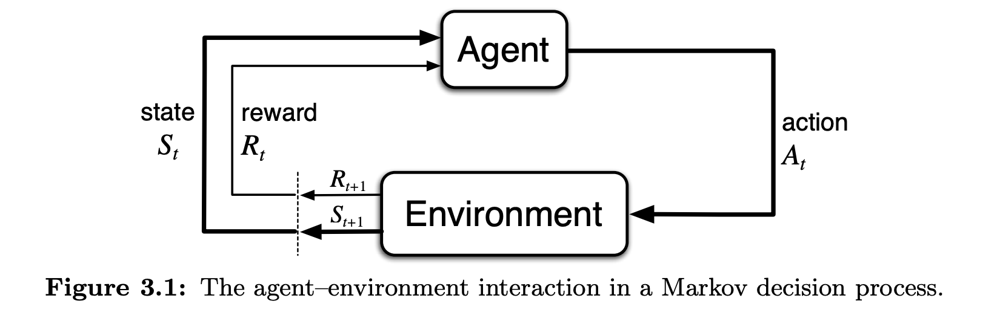
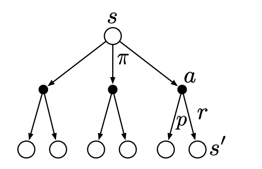
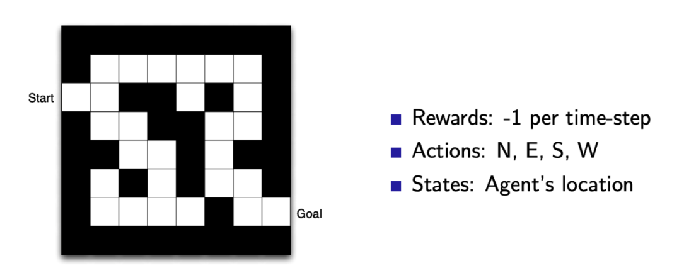
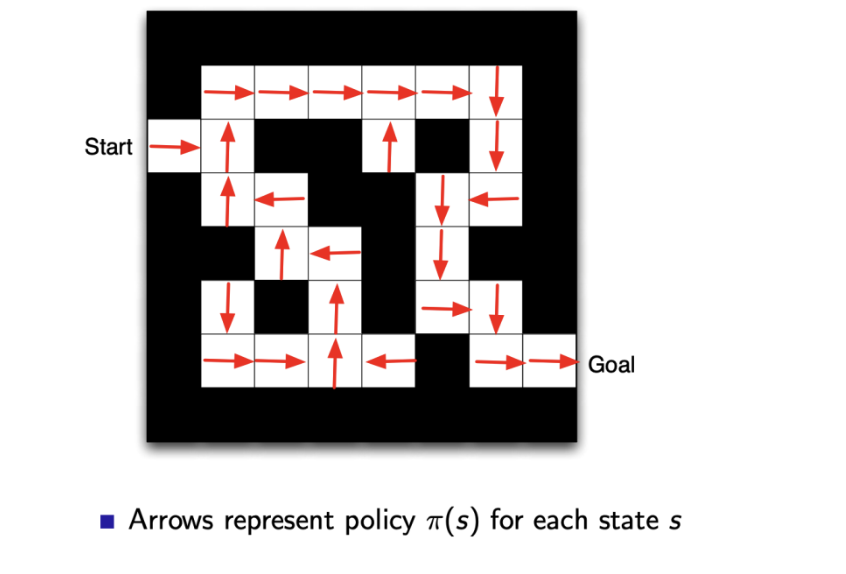
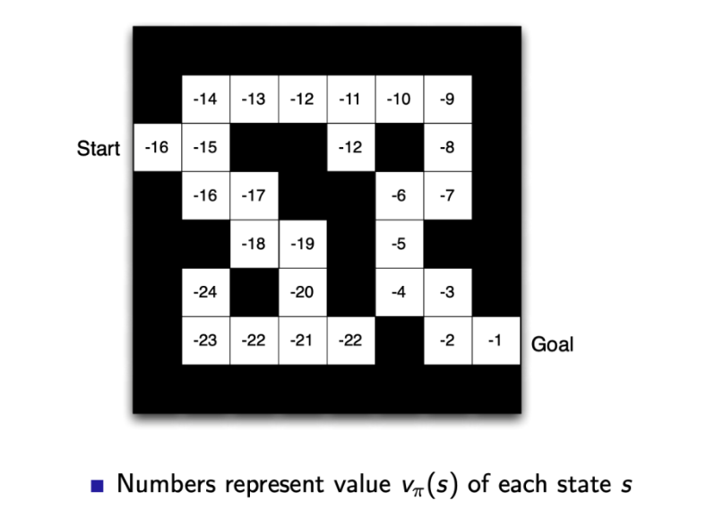

# Finite Markov Decision Processes
## The Agent-Environment Interface
- Learning can be framed as an **agent** interacting with an **environment** by selecting actions, which results in new environment states presented to the agent, alongside a reward - the agent must try to maximize the reward over time
  - 
- A **trajectory** is a time sequence of states, actions, and rewards
  - e.g. $S_0, A_0, R_1, S_1, A_1, R_2, S_2, A_2, R_3, ...$
  - In a *finite* Markov Decision Process, there are a finite number of states, actions, and rewards
- With a finite Markov Decision Process, the reward and state variables have well-defined probability distributions that only depend *only* on the previous state and action - this is the **Markov property (assumption)**
  - $p(s',r|s,a) = Pr\{S_t=s', R_t = r | S_{t-1} = s, A_{t-1}=a\}$
  - $\sum_{s' \in S} \sum_{r \in R} p(s', r | s, a) =1$
  - State transition probabilities:
    - $p(s'|s,a) = Pr\{S_t = s' | S_{t-1}=s, A_{t-1}=a\}=\sum_{r \in R}p(s', r|s,a)$
  - Expected rewards for state-action pairs:
    - $r(s,a) = E[R_t | S_{t-1}=s, A_{t-1}=a] = \sum_{r \in R}r \sum_{s' \in S}p(s', r| s,a)$
  - Expected rewards for state-action-next-state triples:
    - $r(s, a, s') = E[R_t | S_{t-1}=s, A_{t-1}=a, S_t=s'] = \sum_{r \in R} r \frac{p(s', r | s,a)}{p(s'|s,a)}$
- In general, anything that cannot be *changed arbitrarily by the agent* is considered to be outside of it and thus part of the environment
## Goals and Rewards
- **Reward Hypothesis**: The goal of an agent can be thought of as the *maximization* of the expected value of the cumulative sum of a received scalar signal (reward)
- Reward signals can be very flexible if engineered cleverly
  - e.g. Give a robot a *negative reward* each time it bumps into things
- If we want to try to "teach" an agent to do something, a reward must be provided in such a way that maximizing the reward will result in that action
  - However, reward signals should not be overengineered - rewards are for communicating *what* needs to be achieved but not *how* it should be achieved (the agent should figure this out optimally on its own)
## Returns and Episodes
- If the sequence of rewards received after time step *t* is denoted $R_{t+1}, R_{t+2}, R_{t+3}, ... + R_T$, then the goal is to maximize the *expected return*
  - This notion makes sense in interactions that can be broken into *episodes*, which have a special *terminal state* that is followed by a reset into a starting state
- For *non-episodic tasks*, or *continuing tasks*, it could be the case that $T=\infty$, so it is necessary to apply discounting to ensure a finite expected future reward
  - $G_t = R_{t+1} + \gamma R_{t+2} + \gamma^2 R_{t+3} + ... = \sum_{k = 0}^\infty \gamma^k R_{t + k + 1}$
    - $0 \leq \gamma \leq 1$, where $\gamma$ is the discount rate
    - As $\gamma$ approaches 1, the agent becomes more farsighted
  - Note that: $G_t = R_{t+1} + \gamma R_{t+2} + \gamma^2 R_{t+3} + ... = R_{t+1} + \gamma G_{t+1}$
- Both episodic and continuing tasks can be mathematically unified under a single notation by treating an episode termination as entering a special *absorbing state* that transitions only to itself and generates only rewards of zero
  - This gives the same return whether one sums over the first $T$ rewards or over the full infinite sequence
  - $G_t = \sum_{k = t + 1}^T \gamma^{k - t - 1}R_k$ which includes the possibility that $T = \infty$ or (exclusive) $\gamma = 1$
## Policies and Value Functions
- A **policy** is a mapping from states to probabilities of selecting each possible action denoted as $\pi(a|s)$
- The **value function** of a state under a policy is the *expected return* when starting in state *s* and following $\pi$ thereafter
  - $v_\pi(s) = E_\pi [G_t | S_t = s] = E_\pi [\sum_{k = 0}^\infty \gamma^k R_{t+k+1} | S_t = s]$
- Related is the **action-value function** for policy $\pi$, which defines the value of taking action $a$ in state $s$ and following $\pi$ thereafter under policy $\pi$
  - $q_\pi(s,a)=E_\pi [G_t | S_t = s, A_t = a] = E_\pi [\sum_{k = 0}^\infty \gamma^k R_{t+k+1} | S_t = s, A_t = a]$
- Both $v$ and $q$ can be estimated from experience
  - For $v$, an agent can maintain an average, for each state encountered, of the actual returns that have followed that state
  - For $q$, the agent can also maintain separate averages of returns for each action taken in each state
  - These are *Monte Carle methods* and may not be practical since they require averaging over many random samples of actual returns - which does not work if there are *many states*
  - In practice, the agent should try to maintain $v_\pi$ and $q_\pi$ as paramaterized (neural) functions and adjust the parameters to match observed returns
- Value functions can be expressed recursively - this is the **Bellman equation** for $v_\pi$
  - $v_\pi(s) = E_\pi[G_t | S_t = s]$
  - $= E_\pi[R_{t+1} + \gamma G_{t+1} | S_t = s]$
  - $= \sum_a \pi(a|s)\sum_{s'} \sum_r p(s', r | s, a)[r + \gamma E_\pi[G_{t+1} | S_t = s']]$
    - The term $\pi(a|s)p(s', r|s, a)$ represents the joint probability of the entire trajectory step ($P(a, s', r |s)$), but we need the expectation over all three variables $a, s', r$ in order to get every possible value
    - In terms of expectation, the bracket terms are the different rewards trajectories that can be obtained if (assuming we start at $s$) take action $a$ and the environment produces reward $r$ and next state $s'$, and we must sum over all possible probabilities of triplets of $a, s', r$ 
  - $= \sum_a \pi(a|s)\sum_{s', r} p(s', r | s, a)[r + \gamma v_\pi(s')]$
- The Bellman equation expresses the relationship between the value of a state and its successor states
  - 
  - At a state $s$, the agent could take any set of actions (based on $\pi$) and from these actions, the environment could respond with any of several next states $s'$ along with a reward
  - The equation averages over all of the possibilities (weighted) and finds that the value of the start state must equal the discounted value of the expected next state plus the expecte reward along the way
## Optimal Policies and Optimal Value Functions
- Solving a reinforcement learning task involves roughly finding a policy that achieves a lot of reward over the long run, and this can be determined using value functions
  - Determine a policy $\pi$ such that, for all other policies $\pi'$, $v_\pi(s) \geq v_{\pi'}(s)$
    - $v_*(s)=\max_\pi v_\pi(s)$ for all $s$
    - $q_*(s, a)=\max_\pi q_\pi(s, a)$
      - Expected return for taking action $a$ in state $s$ and thereafter following an optimal policy
- **Bellman Optimality Equation**: The value of a state under an optimal policy must equal the expected return for the best action from that state
  - $v_*(s) = \max_a q_{\pi_*}(s,a)$
  - $= \max_a E[R_{t+1} + \gamma v_* (S_{t+1}) | S_t = s, A_t = a]$
  - $= \max_a \sum_{s', r} p(s', r| s,a)[r + \gamma v_*(s')]$
  - Similarly:
    - $q_*(s,a) = E[R_{t+1} + \gamma \max_{a'} q_* (S_{t+1}, a') | S_t = s, A_t = a]$
    - $= \sum_{s', r} p(s', r | s, a)[r + \gamma \max_{a'} q_* (s', a')]$
- Given $v_*$, the optimal policy involves *greedily* selects the action with the best one-step ahead consequence
  - Even though this is greedy, it is still optimal in the long term because $v_*$ takes into account reward consequences of future behavior
- Given $q_*$, optimal policy is easier: just select the action that maximizes $q_*(s,a)$
- Explicitly solving the Bellman optimality equation is seldom done since it is typically an exhaustive search and many of the assumptions for it (that the dynamics of the environment are accurately known and the states have the Markov property) may not even hold up in practice
  - Thus, in practice the optimal policy is instead often *approximated*
- Example: Maze
  - 
  - 
  - 
    - Note that, given the value function, the maze can be solved by taking a one-step-ahead look at each possible state (after performing an action in a given cell) and greedily following the highest values
- Types of RL Agents:
  - Value-Based: Learn value function and use this
    - Explicit: Value Function
    - Implicit: Policy (can derive a policy from value function)
  - Policy-Based: Use just the policy, evaluated at each state, to make decisions
    - Explicit: Policy
    - No value function
  - Actor-Critic: Use both
    - Explicit: Policy AND value function
  - Model-based: 
    - Explicit: Model learned
    - May or may not have policy and/or value function
- Exploration versus Exploitation:
  - Agent only experiences actions that it tries, but it still must balance **exploration** - trying new things that might enable the agent to make better decisions in the future - and **exploitation** - actions that are expected to yield good reward given past experience
  - There is a tradeoff here; the agent may have to sacrifice reward in order to explore and learn potentially better policy
- Multi-arm / Contextual Bandits: A type of problem where the decision maker iteratively selects one of multiple fixed choices when properties of each choice are only partially known at the time of allocation, but may become clear over time
  - This is relevant in the context of content recommendation algorithms, as an agent (e.g. YouTube) may not know which recommended items the user actually likes, but can learn over time as they try different recommendation choices
## Coding with RL
- **Gym**: Toolkit for developing and comparing reinforcement learning algorithms
-     import gym
      env = gym.make("Taxi-v2") # Make environment 
      observation = env.reset() # Reset environment
      agent = oad_agent()
      for step in range(100):
        action = agent(observation)
        observation, reward, done, info = env.step(action)
- Example: CartPole-v0. Reward is 1 for every step taken, including the termination step
  -     import gym
        env = gym.make('CartPole-v0')
        env.reset()
        env.render() # Display rendered scene
        action = env.action_space.sample()
        observation, reward, done, info = env.step(action)