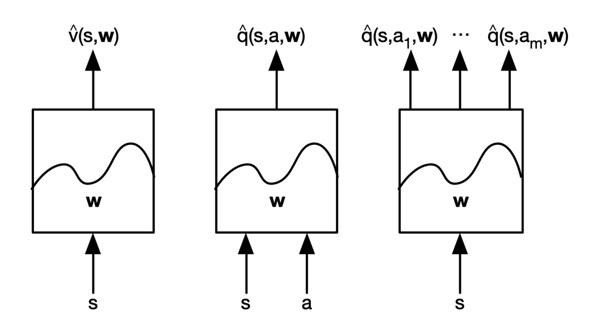
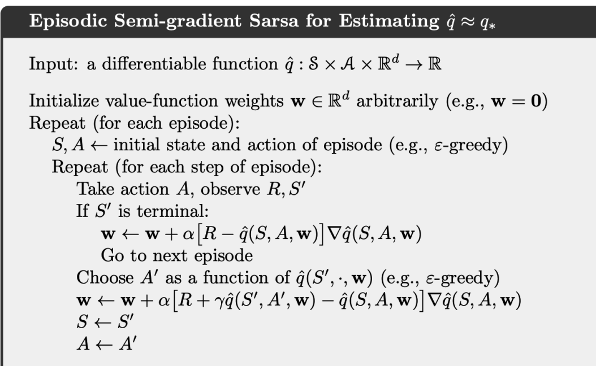
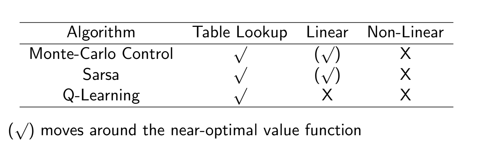
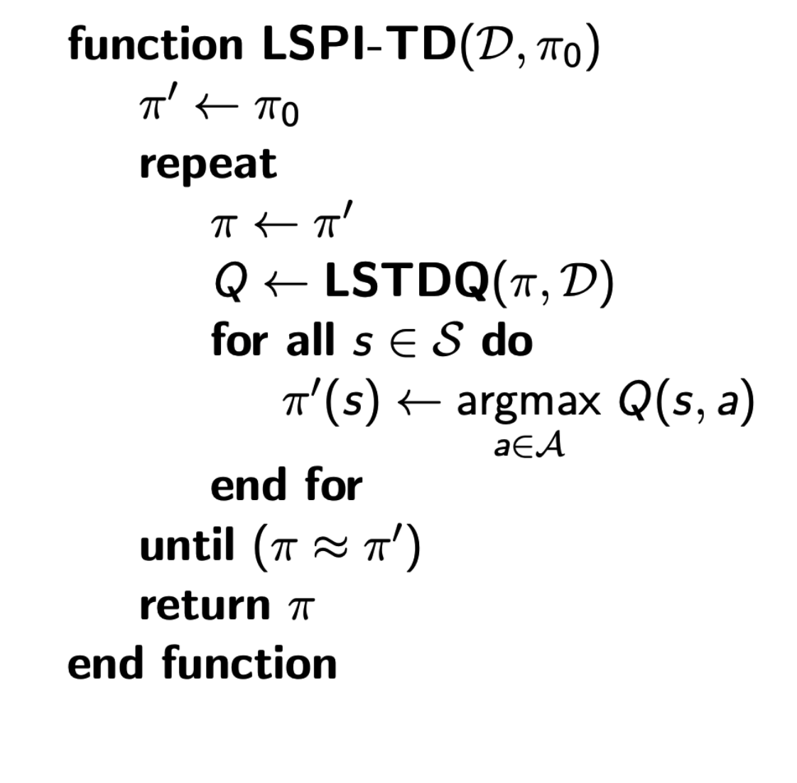
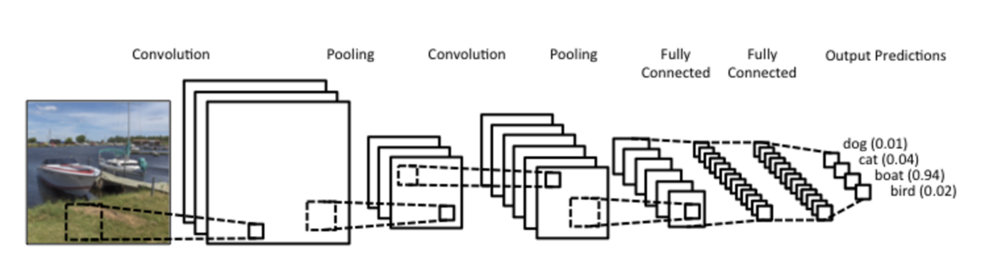

# Value Function Approximation and Deep Q-Learning
## Introduction to Function Approximation
- **Tabular reinforcement learning** approaches do not scale very well, especially as we increase the number of states - there is just not enough memory to store the value for every state via $V(s)$ or to store every state-action pair via $Q(s, a)$
  - e.g. Go has $10^{170}$ states
  - Other problems have a *continuous* state space, so it would be necessary to discretize the state space (which is not very feasible)
- Various terms can be estimated via **function approximators**
  - $\hat{v}(s, \bold{w}) \approx v^\pi (s)$
  - $\hat{q}(s, a, \bold{w}) \approx q^\pi (s, a)$
  - $\hat{pi}(a, s \bold{w}) \approx \pi (a|s)$
  - 
    - For the state-action value function, typically the approximator just takes in the *state* and then outputs the state-action value over the set of actions - `argmax` can be performed on the output to get the best action
### Learning with an Oracle
- Assume that there is an oracle for knowing $v^\pi (s)$ for any given state $s$
  - Loss: $J(\bold{w}) = \mathbb{E}[(v^\pi (s) - \hat{v}(s, \bold{w}))^2]$
    - $\Delta \bold{w} = - \frac{1}{2} \alpha \nabla J(\bold{w})$
    - $\bold{w}_{t+1} = \bold{w}_t + \Delta \bold{w}$
- The state can be compactly represented using *feature vectors*:
  - $\bold{x}(s) = (x_1 (s), ..., x_n(s))^T$
  - e.g. 
    - Mountain Car - state contains position of car, velocity of car
    - Cart Pole - state contains position of car, velocity of car, angle of pole, rotation rate of pole
- Linear Function Approximation:
  - $\hat{v}(s, \bold{w}) = \bold{x}(s)^T \bold{w} = \sum_{j = 1}^n x_j (s) w_j$
  - $J(\bold{w}) = \mathbb{E} [(v^\pi (s) - \bold{x}(s)^T\bold{w})^2]$
  - $\Delta \bold{w} = - \alpha (v^\pi (s) - \hat{v}(s, \bold{w}))\bold{x}(s)$
    - Update = Step Size * Prediction Error * Feature Value
- Table lookup is a special case of linear value function approximation, where the feature is a *one-hot vector*
  - $\bold{x}^{\text{table}}(S) = (\bold{1}(S=s_1), ..., \bold{1}(S=s_n))^T$
  - This is useful for environments such as Gridworld, where we can just use a 1-hot vector to represent which of the states the agent is in (e.g. [1, 0, 0, 0] if in the first, top-left, state)
  - $\hat{v}(S, \bold{w}) = (\bold{1}(S=s_1), ..., \bold{1}(S=s_n))(w_1, ..., w_n)^T$
    - $\hat{v}(s_k, \bold{w}) = w_k$
## Value Function Approximation for Prediction
- In practice, we do not actually have access to the oracle of the true value for any state - thus, we must rely on model-free methods 
  - Evaluate $v^\pi$ following a fixed policy $\pi$
  - Maintain an estimate of $v^\pi$ or $q^\pi$
  - Update estimates after each episode (Monte Carlo) or afte reach step (Temporal Difference)
- Substitute a **target** for $v^\pi(s)$
  - Monte Carlo: Use actual return $G_t$
    - $\Delta \bold{w} = \alpha (G_t - \hat{v} (S_t, \bold{w})) \nabla_{\bold{w}} \hat{v} (S_t, \bold{w})$
  - TD(0): Use $R_{t+1} + \gamma \hat{v}(S_{t+1}, \bold{w})$
    - $\Delta \bold{w} = \alpha (R_{t+1} + \gamma \hat{v}(S_{t+1}, \bold{w}) - \hat{v} (S_t, \bold{w})) \nabla_{\bold{w}} \hat{v} (S_t, \bold{w})$
      - Note that here we are *bootstrapping* on the previous function estimate (inference mode)
- Using Monte Carlo is an *unbiased* but *noisy* sample of the true value $v^\pi (S_t)$
  - The training data is a set of $<S_1, G_1>, <S_2, G_2>, ..., <S_T, G_T>$
  - $\Delta \bold{w} = \alpha (G_t - \hat{v}(S_t, \bold{w}))\bold{x}(S_t)$
- Using Temporal Difference is a *biased* destimate of the true value - it is biased because it is drawn from the previous estimate rather than the true value
  - The training data is $<S_1, R_2 + \gamma \hat{v} (S_2, \bold{w})>, ..., <S_{T-1}, R_T>$
  - $\Delta \bold{w} = \alpha (R + \gamma \hat{v}(S', \bold{w}) - \hat{v} (S, \bold{w})) \nabla_{\bold{w}} \hat{v} (S_t, \bold{w}) = \alpha (R + \gamma \hat{v}(S', \bold{w}) - \hat{v} (S, \bold{w})) \bold{x}(S)$
    - This is known as **semi-gradient**, since we ignore the effect of changing the weight vector **w** on the target (which uses **w** since it is bootstrapped from the previous estimate)
## Value Function Approximation for Control
- Approximating action-value function:
  - $\hat{q}(s, a, \bold{w}) \approx q^\pi (s, a)$
  - $J(\bold{w}) =  \mathbb{E}[(q^\pi (s, a) - \hat{q}(s, a, \bold{w}))^2]$
  - Represent state and action using a feature vector:
    - $\bold{x}(s, a) = (x_1(s, a), ..., x_n(s, a))^T$
    - $\hat{q}(s, a, \bold{w}) = \bold{x}(s, a)^T \bold{w}$
    - $\Delta \bold{w} = \alpha (q^\pi (s,a) - \hat{q}(s, a, \bold{w})) \bold{x} (s, a)$
  - Since there is no oracle:
    - MC: $\Delta \bold{w} = \alpha(G_t - \hat{q}(S_t, A_t, \bold{w}))\nabla_{\bold{w}} \hat{q}(S_t, A_t, \bold{w})$
    - TD: $\Delta \bold{w} = \alpha(R_{t+1} + \gamma \hat{q}(S_{t+1}, A_{t+1}, \bold{w}) - \hat{q}(S_t, A_t, \bold{w}))\nabla_{\bold{w}} \hat{q}(S_t, A_t, \bold{w})$
    - Q-Learning: $\Delta \bold{w} = \alpha(R_{t+1} + \gamma \max_{a} \hat{q}(S_{t+1}, a, \bold{w}) - \hat{q}(S_t, A_t, \bold{w}))\nabla_{\bold{w}} \hat{q}(S_t, A_t, \bold{w})$
- 
- There are no guarantees for convergence for Sarsa and Q-Learning
  - Since the behavior policy and target policy are not identical, the value function approximation can diverge
  - Things that may cause instability: 
    - Function approximation
    - Bootstrapping
    - Off-policy learning
  - 
    - Linear approximators can get close to the near-optimal value function as long as they are on policy
## Batch RL and Least-Square Prediction and Control
- Batched updates are more sample efficient than using single instances of experience
- Given several transition samples, we can sample a minibatch:
  - $\mathcal{D} = \{ <s_1, v_1^\pi>, ..., <s_T, v_T^\pi> \}$
  - $\bold{w}^* = \argmin_{\bold{w}} \mathbb{E}_{\mathcal{D}}[(v^\pi - \hat{v}(s, \bold{w}))^2] = \argmin_{\bold{w}} \sum_{t = 1}^T (v_t^\pi - \hat{v}(s_t, \bold{w}))^2$
  - Iterative Stochastic Gradient Descent with Experience Replay:
    - Sample one pair of <state, value> from the experience: $<s, v^\pi> \sim \mathcal{D}$
    - Apply stochastic gradient descent update: $\Delta \bold{w} = \alpha (v^\pi - \hat{v}(s, \bold{w})) \nabla_\bold{w} \hat{v}(s, \bold{w})$
    - This will converge towards the least-squares solution
- With a linear value function approximator, we could try to explicitly solve the least-squares equation
  - $\mathbb{E}_D [\Delta \bold{w}] = 0 \rightarrow \Delta \bold{w} = \alpha \sum_{t=1}^T \bold{x} (s_t) (v_t^\pi - \bold{x}(x_t)^T \bold{w}) = 0$
  - $\bold{w} = (\sum_{t=1}^T \bold{x}(s_t) \bold{x}(s_t)^T)^{-1} \sum_{t=1}^T \bold{x}(s_t) v^\pi_t$ 
    - This is in $O(N^3)$ complexity, though, so it is quite expensive
  - Also, since we do not really know the true values of $v^\pi_t$, we typically use the noisy (Monte Carlo) or biased (TD) samples of $v_t^\pi$
    - Least-Squares Monte Carlo:
      - $\bold{w} = (\sum_{t=1}^T \bold{x}(s_t) \bold{x}(s_t)^T)^{-1} \sum_{t=1}^T \bold{x}(s_t) G_t$
    - Least-Squares TD:
      - $\bold{w} = (\sum_{t=1}^T \bold{x}(s_t) (\bold{x}(s_t) - \gamma \hat{v}(S_{t+1}))^T)^{-1} \sum_{t=1}^T \bold{x}(s_t) R_{t+1}$
- Least-Squares Control:
  - Use Q-Learning: Use the experience generated by the old policy: $S_t, A_t, R_{t+ 1}, S_{t + 1} \sim \pi_{\text{old}}$
  - Consider alternate successor action $A' = \pi_{new}(S_{t+1})$ using greedy 
  - Update $\hat{q}(S_t, A_t, \bold{w})$ towards $R_{t+1} + \gamma \hat{q}(S_{t+1}, A', \bold{w})$
    - Specifically: $\bold{w} = (\sum_{t=1}^T \bold{x}(S_t, A_t)(\bold{x}(S_t, A_t)- \gamma \bold{x}(S_{t+1}, \pi(S_{t+1})))^T)^{-1} \sum_{t=1}^T \bold{x}(S_t, A_t) R_{t+1}$
  - 
## Deep-Q Learning
- Linear value function approximation can work well with the right set of features, but requires manual designing of the feature set
- In practice, nonlinear function approximators (deep neural networks) are used since they can learn directly from the state without requiring feature design
  - $f(\bold{x}; \theta) = \bold{W}^T_{L + 1} \sigma(\bold{W}_L^T \sigma(...\sigma(\bold{W}_1^T + \bold{x} + \bold{b}_1)) + \bold{b}_L) + \bold{b}_{L - 1}$
  - Chain rule in backpropagation to update weights
- Convolutional neural networks are used to encode image-based states, as they excel in encoding local information in a 2D feature map
  - 
- Use deep neural networks to parameterize:
  - Value Functions
  - Policy Functions (via policy gradient methods)
  - World model
- In **Deep Q-Learning**, the action-value function is represented with a neural network approximator
  - $J(\bold(w)) = \mathbb{E}_\pi = [(q_\pi (S,A) - \hat{q}(S, A, \bold{w}))^2]$
  - Monte Carlo:
    - $\Delta \bold{w} = \alpha (G_t - \hat{q}(S_t, A_t, \bold{w})) \nabla_{\bold{w}} \hat{q}(S_t, A_t, \bold{w})$
  - Sarsa (TD):
    - $\Delta \bold{w} = \alpha (R_{t+1} + \gamma \hat{q}(S_{t+1}, A_{t+1}, \bold{w}) - \hat{q}(S_t, A_t, \bold{w})) \nabla_{\bold{w}} \hat{q}(S_t, A_t, \bold{w})$
  - Q-Learning:
    - $\Delta \bold{w} = \alpha (R_{t+1} + \gamma \max_{a} \hat{q}(S_{t+1}, a, \bold{w}) - \hat{q}(S_t, A_t, \bold{w})) \nabla_{\bold{w}} \hat{q}(S_t, A_t, \bold{w})$
    - This is a semi-gradient method, as discussed earlier, since to get the gradient we must use inference on the approximator
- In the original Deep Q Learning paper, agents were trained to play Atari games
  - The input state $s$ was a stack of raw pixels from the latest $4$ frames (to get some temporal information)
  - The output $Q(s, a)$ is 18 joystick/button positions
  - Reward is the change in score for that step
- Some issues in previous attempts at Deep Q Learning were:
  - Correlations between samples: Makes it difficult to generalize - especially since the video frames gathered from the game are very close to each other
    - Solved using **experience replay**: Store transitions $(s_t, a_t, r_t, s_{t+1})$ in replay memory $\mathcal{D}$
      - Sample an experience tuple from the dataset $(s, a, r, s') \sim \mathcal{D}$
      - Compute target value from sampled tuple: $r + \gamma \max_a \hat{q}(s', a, \bold{w})$
      - Use stochastic gradient descent to update network weights: 
        - $\Delta \bold{w} = \alpha (r + \gamma \max_a \hat{q}(s', a, \bold{w}) - \hat{q}(s, a, \bold{w})) \nabla_{\bold{w}} \hat{q}(s, a, \bold{w})$
      - We can do this because Q-Learning is off-policy - so old samples can be reused
    - Typically, the replay buffer is imeplemented using a queue - so stale (oldest) experiences are tossed out once full
  - Non-stationary targets: The target is a function of the estimator, and so it is changing over time (non-stationary), which can lead to unstable learning
    - Solved using a **fixed target**: fix the target weights used in target calculation for multiple updates
      - Let $\bold{w}^-$ be the target weights and $\bold{w}$ be the current weights being updated
      - Perform experience replay:
        - Sample $(s, a, r, s') \sim \mathcal{D}$
        - Compute target value from sampled tuple: $r + \gamma \max_{a'} \hat{q}(s', a', \bold{w^-})$
        - Use stochastic gradient descent to update network weights: 
          - $\Delta \bold{w} = \alpha (r + \gamma \max_{a'} \hat{q}(s', a', \bold{w^-}) - \hat{q}(s, a, \bold{w})) \nabla_{\bold{w}} \hat{q}(s, a, \bold{w})$
## Misc
- **DQN Improvements**:
  - **Double DQN**: Use *two networks* to decouple the action selection from the target Q-value generation
    - $\Delta \bold{w} = \alpha(r + \gamma \hat{Q}(s', \argmax_{a'} Q(s', a', \bold{w}), \bold{w}^-) - Q(s, a, \bold{w})) \nabla \hat{Q}(s, a, \bold{w})$
  - **Dueling DQN**: One branch estimates $V(s)$ and the other estimates the advantage for each action $A(s, a)$ - thus, $Q(s, a) = A(s, a) + V(s)$
    - Doing this can enable the network to learn which states are (or are not) valuable without having to learn the effect of the action on each state
    - 
  - **Prioritized Experience Replay**: Put higher priority on experiences where there is a large difference between the prediction and TD-target
    - With large differences, it is likely that more can be learned about that transition
    - $p_i = |r + \gamma \max_{a'} Q(s_{i + 1}, a', \bold{w^-}) - Q(s_i, a_i, \bold{w})|$
- DQN Implementation:
  -     class Model(BaseAgent):
          def __init__(self, static_policy=False, env=None, config=None):
              super(Model, self).__init__()
              self.device = config.device

              self.gamma = config.GAMMA
              self.lr = config.LR
              self.target_net_update_freq = config.TARGET_NET_UPDATE_FREQ
              self.experience_replay_size = config.EXP_REPLAY_SIZE
              self.batch_size = config.BATCH_SIZE
              self.learn_start = config.LEARN_START

              self.static_policy = static_policy
              self.num_feats = env.observation_space.shape
              self.num_actions = env.action_space.n
              self.env = env

              self.declare_networks()
                  
              self.target_model.load_state_dict(self.model.state_dict())
              self.optimizer = optim.Adam(self.model.parameters(), lr=self.lr)
              
              #move to correct device
              self.model = self.model.to(self.device)
              self.target_model.to(self.device)

              if self.static_policy:
                  self.model.eval()
                  self.target_model.eval()
              else:
                  self.model.train()
                  self.target_model.train()

              self.update_count = 0

              self.declare_memory()
              

          def declare_networks(self):
              self.model = DQN(self.num_feats, self.num_actions)
              self.target_model = DQN(self.num_feats, self.num_actions)

          def declare_memory(self):
              self.memory = ExperienceReplayMemory(self.experience_replay_size)

          def append_to_replay(self, s, a, r, s_):
              self.memory.push((s, a, r, s_))

          def prep_minibatch(self):
              # random transition batch is taken from experience replay memory
              transitions = self.memory.sample(self.batch_size)
              
              batch_state, batch_action, batch_reward, batch_next_state = zip(*transitions)

              shape = (-1,)+self.num_feats

              batch_state = torch.tensor(batch_state, device=self.device, dtype=torch.float).view(shape)
              batch_action = torch.tensor(batch_action, device=self.device, dtype=torch.long).squeeze().view(-1, 1)
              batch_reward = torch.tensor(batch_reward, device=self.device, dtype=torch.float).squeeze().view(-1, 1)
              
              non_final_mask = torch.tensor(tuple(map(lambda s: s is not None, batch_next_state)), device=self.device, dtype=torch.uint8)
              try: #sometimes all next states are false
                  non_final_next_states = torch.tensor([s for s in batch_next_state if s is not None], device=self.sdevice, dtype=torch.float).view(shape)
                  empty_next_state_values = False
              except:
                  non_final_next_states = None
                  empty_next_state_values = True

              return batch_state, batch_action, batch_reward, non_final_next_states, non_final_mask, empty_next_state_values

          def compute_loss(self, batch_vars):
              batch_state, batch_action, batch_reward, non_final_next_states, non_final_mask, empty_next_state_values = batch_vars

              #estimate
              current_q_values = self.model(batch_state).gather(1, batch_action)
              
              #target
              with torch.no_grad():
                  max_next_q_values = torch.zeros(self.batch_size, device=self.device, dtype=torch.float).unsqueeze(dim=1)
                  if not empty_next_state_values:
                      max_next_action = self.get_max_next_state_action(non_final_next_states)
                      max_next_q_values[non_final_mask] = self.target_model(non_final_next_states).gather(1, max_next_action)
                  expected_q_values = batch_reward + (self.gamma*max_next_q_values)

              diff = (expected_q_values - current_q_values)
              loss = self.huber(diff)
              loss = loss.mean()

              return loss

          def update(self, s, a, r, s_, frame=0):
              if self.static_policy:
                  return None

              self.append_to_replay(s, a, r, s_)

              if frame < self.learn_start:
                  return None

              batch_vars = self.prep_minibatch()

              loss = self.compute_loss(batch_vars)

              # Optimize the model
              self.optimizer.zero_grad()
              loss.backward()
              for param in self.model.parameters():
                  param.grad.data.clamp_(-1, 1)
              self.optimizer.step()

              self.update_target_model()
              self.save_loss(loss.item())
              self.save_sigma_param_magnitudes()

          def get_action(self, s, eps=0.1):
              with torch.no_grad():
                  if np.random.random() >= eps or self.static_policy:
                      X = torch.tensor([s], device=self.device, dtype=torch.float)
                      a = self.model(X).max(1)[1].view(1, 1)
                      return a.item()
                  else:
                      return np.random.randint(0, self.num_actions)

          def update_target_model(self):
              self.update_count+=1
              self.update_count = self.update_count % self.target_net_update_freq
              if self.update_count == 0:
                  self.target_model.load_state_dict(self.model.state_dict())

          def get_max_next_state_action(self, next_states):
              return self.target_model(next_states).max(dim=1)[1].view(-1, 1)

          def huber(self, x):
              cond = (x.abs() < 1.0).to(torch.float)
              return 0.5 * x.pow(2) * cond + (x.abs() - 0.5) * (1 - cond)

        # Training loop
        observation = env.reset()
        for frame_idx in range(1, config.MAX_FRAMES + 1):
            epsilon = config.epsilon_by_frame(frame_idx)

            action = model.get_action(observation, epsilon)
            prev_observation=observation
            observation, reward, done, _ = env.step(action)
            observation = None if done else observation

            model.update(prev_observation, action, reward, observation, frame_idx)
            episode_reward += reward

            if done:
                observation = env.reset()
                model.save_reward(episode_reward)
                episode_reward = 0
                
                if np.mean(model.rewards[-10:]) > 19:
                    plot(frame_idx, model.rewards, model.losses, model.sigma_parameter_mag, timedelta(seconds=int(timer()-start)))
                    break

            if frame_idx % 10000 == 0:
                plot(frame_idx, model.rewards, model.losses, model.sigma_parameter_mag, timedelta(seconds=int(timer()-start)))
